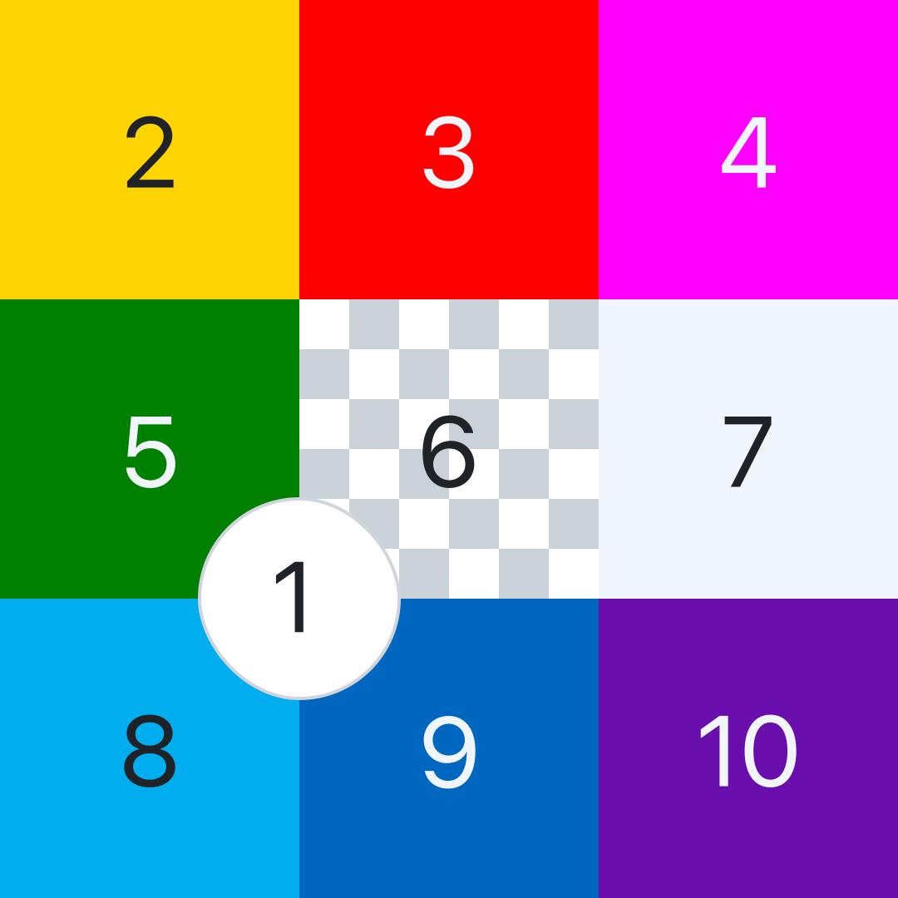
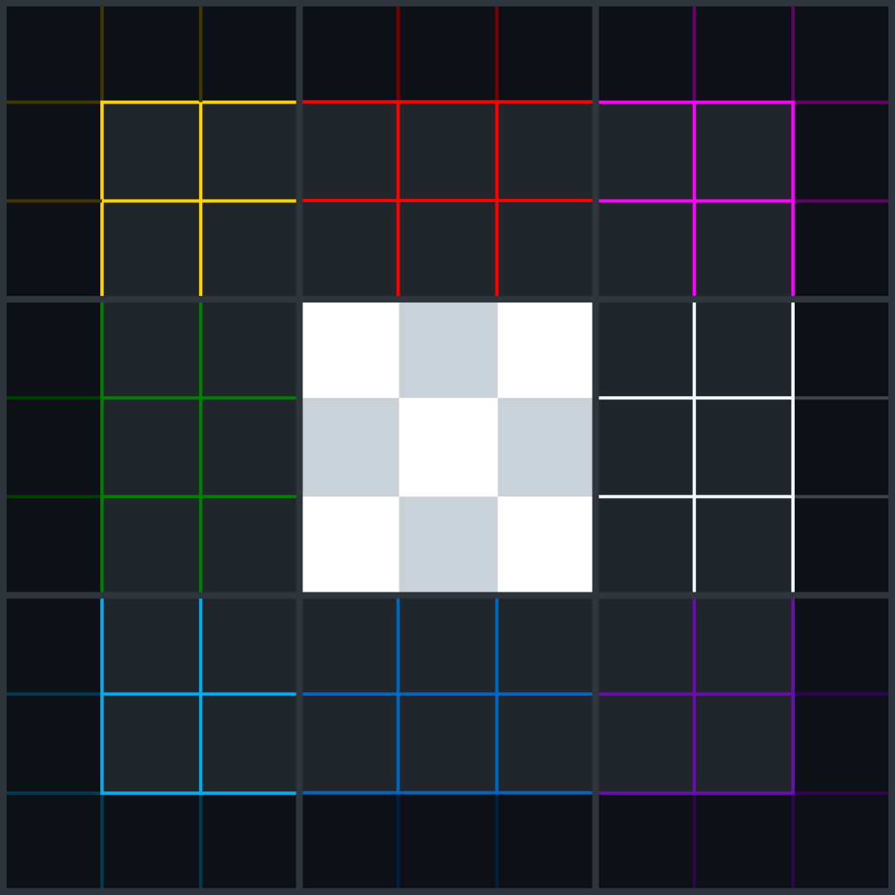

[← Back to Main README](./README.md)

# Assets

This page provides downloadable assets of the **Mapping the Prompt (MTP)** project.  
While the [README](./README.md) displays optimized **SVG** images, here you can also find **PNG** versions for compatibility (e.g., applications or platforms that do not fully support SVG).

Each table below lists available formats of the project’s visual assets.

---

### MTP Grid 3×3 (Side A, Numbered + Node Labels)

  

| SVG                                                             | PNG                                                                       | PNG                                                                       |
| --------------------------------------------------------------- | ------------------------------------------------------------------------- | ------------------------------------------------------------------------- |
| [Original file](./assets/svg/mtp-grid-3x3-a-num-node.svg?raw=1) | [1,080 × 1,350 pixels](./assets/png/1x/mtp-grid-3x3-a-num-node.png?raw=1) | [2,160 × 2,700 pixels](./assets/png/2x/mtp-grid-3x3-a-num-node.png?raw=1) |

---

### MTP Grid 3×3 (Side A, Numbered)

  

| SVG                                                        | PNG                                                                  | PNG                                                                  |
| ---------------------------------------------------------- | -------------------------------------------------------------------- | -------------------------------------------------------------------- |
| [Original file](./assets/svg/mtp-grid-3x3-a-num.svg?raw=1) | [1,080 × 1,080 pixels](./assets/png/1x/mtp-grid-3x3-a-num.png?raw=1) | [2,160 × 2,160 pixels](./assets/png/2x/mtp-grid-3x3-a-num.png?raw=1) |

---

### MTP Grid 3×3 (Side B, Numbered + Node Labels)

  

| SVG                                                             | PNG                                                                       | PNG                                                                       |
| --------------------------------------------------------------- | ------------------------------------------------------------------------- | ------------------------------------------------------------------------- |
| [Original file](./assets/svg/mtp-grid-3x3-b-num-node.svg?raw=1) | [1,080 × 1,350 pixels](./assets/png/1x/mtp-grid-3x3-b-num-node.png?raw=1) | [2,160 × 2,700 pixels](./assets/png/2x/mtp-grid-3x3-b-num-node.png?raw=1) |

---

### MTP Grid 3×3 (Side B, Numbered)

  

| SVG                                                        | PNG                                                                  | PNG                                                                  |
| ---------------------------------------------------------- | -------------------------------------------------------------------- | -------------------------------------------------------------------- |
| [Original file](./assets/svg/mtp-grid-3x3-b-num.svg?raw=1) | [1,080 × 1,080 pixels](./assets/png/1x/mtp-grid-3x3-b-num.png?raw=1) | [2,160 × 2,160 pixels](./assets/png/2x/mtp-grid-3x3-b-num.png?raw=1) |

---

### MTP Grid 3×3 (Side A)

  

| SVG                                                    | PNG                                                              | PNG                                                              |
| ------------------------------------------------------ | ---------------------------------------------------------------- | ---------------------------------------------------------------- |
| [Original file](./assets/svg/mtp-grid-3x3-a.svg?raw=1) | [1,080 × 1,080 pixels](./assets/png/1x/mtp-grid-3x3-a.png?raw=1) | [2,160 × 2,160 pixels](./assets/png/2x/mtp-grid-3x3-a.png?raw=1) |

---

### MTP Grid 3×3 (Side B)

  

| SVG                                                    | PNG                                                              | PNG                                                              |
| ------------------------------------------------------ | ---------------------------------------------------------------- | ---------------------------------------------------------------- |
| [Original file](./assets/svg/mtp-grid-3x3-b.svg?raw=1) | [1,080 × 1,080 pixels](./assets/png/1x/mtp-grid-3x3-b.png?raw=1) | [2,160 × 2,160 pixels](./assets/png/2x/mtp-grid-3x3-b.png?raw=1) |

---

### MTP Grid 9×9

  

| SVG                                                  | PNG                                                            | PNG                                                            |
| ---------------------------------------------------- | -------------------------------------------------------------- | -------------------------------------------------------------- |
| [Original file](./assets/svg/mtp-grid-9x9.svg?raw=1) | [1,080 × 1,080 pixels](./assets/png/1x/mtp-grid-9x9.png?raw=1) | [2,160 × 2,160 pixels](./assets/png/2x/mtp-grid-9x9.png?raw=1) |

---

### MTP Grid 18×18 (Node Labels)

  

| SVG                                                         | PNG                                                                   | PNG                                                                   |
| ----------------------------------------------------------- | --------------------------------------------------------------------- | --------------------------------------------------------------------- |
| [Original file](./assets/svg/mtp-grid-18x18-node.svg?raw=1) | [1,080 × 1,350 pixels](./assets/png/1x/mtp-grid-18x18-node.png?raw=1) | [2,160 × 2,700 pixels](./assets/png/2x/mtp-grid-18x18-node.png?raw=1) |

---

### MTP Grid 18×18

  

| SVG                                                    | PNG                                                              | PNG                                                              |
| ------------------------------------------------------ | ---------------------------------------------------------------- | ---------------------------------------------------------------- |
| [Original file](./assets/svg/mtp-grid-18x18.svg?raw=1) | [1,080 × 1,080 pixels](./assets/png/1x/mtp-grid-18x18.png?raw=1) | [2,160 × 2,160 pixels](./assets/png/2x/mtp-grid-18x18.png?raw=1) |

---

## License

All materials in this repository — including documents, concepts, and image assets (SVG/PNG) —  
are licensed under the [MIT License](./LICENSE).

Copyright © 2025 **Kohen**
