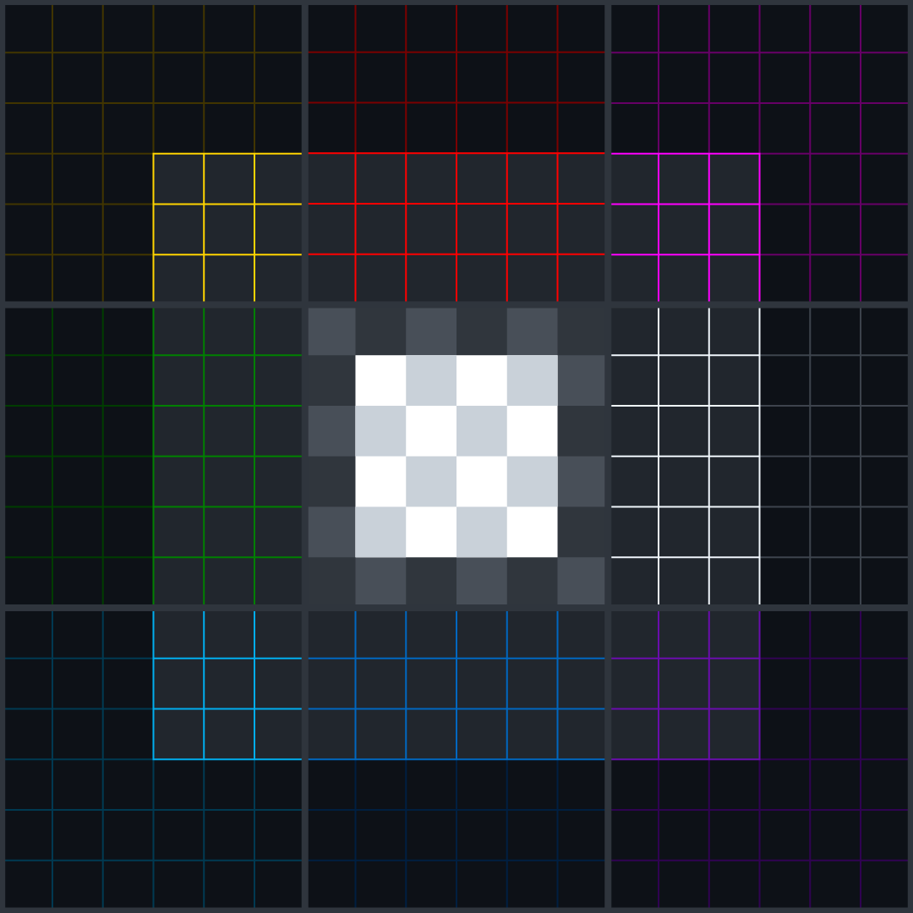

[← Back to Main README](./README.md)

# Concept

> 🌐 原文は[日本語](./ja/CONCEPT.md)で記述されています。この英語版は翻訳です。  
> The original document is written in Japanese. This English version is a translation.

<p align="center">
  
</p>

## Introduction

To understand conversations with generative AI (LLMs), we assume **dialogue as an “information space like a universe.”** In this space, the phenomenon where the model drifts away from the user’s set context and loses consistency can be described as follows:

- 🪐 **Context: a galaxy created by the user**

  - At the start of a conversation, the user sets premises or roles (e.g., “act as an academic expert,” “speak as a specific character”), attempting to form a single galaxy.
  - This establishes the **“rules of consistency”** the model should follow throughout the dialogue.

- 💨 **Drift: the model jumps to another galaxy**

  - When the model fails to maintain those rules and responds from a different premise or context, it is “drifting.”
  - This resembles a collapse of the user’s intended galaxy—conversation deviates in unintended directions.
  - For example, an expert voice suddenly turns into personal opinions, or tone/style changes midstream.

- 🕳️ **Issue: the black hole**
  - The model fixates excessively on certain information or interpretations and ignores other possibilities or contexts.
  - Even if the user probes from different angles, the model returns similar answers or readings.
  - The model is pulled by past strong information instead of building new context from the user’s new inputs.

**MTP** defines and manipulates this “galaxy = context” as **coordinates**. It classifies and visualizes such properties and provides a **framework for a UI** that lets you operate them as a **“map of the conversation.”**

---

## Where the Framework Comes From

MTP treats dialogue with generative AI as a **“map of the conversation.”** At its core is the Eastern **Five Elements (Wu Xing: Wood, Fire, Earth, Metal, Water)**—a schema describing universal structures in nature.

The Five Elements systematizes dynamic interactions and balance in the natural world: different elements influence one another to maintain harmony. MTP builds on this to classify/visualize the complex structure of human–AI dialogue and design an interface that is intuitive to navigate.

> [!IMPORTANT]  
> This framework is not a strict scientific model. It is a structure for dealing with **abstract, ambiguous, and affective intent**.  
> It lets users specify and share their “sense” and “intuition” in simple formats like color and coordinates.  
> That is the core idea of MTP.

### ☯️ Categorization & Five-Element Traits

In Five Elements thought, everything can be organized into the following five categories:

| MTP   | Five Elements | Kanji | Traits                 | Example UI Functions                                                                                   |
| :---- | :------------ | :---- | :--------------------- | :----------------------------------------------------------------------------------------------------- |
| Grow  | **Wood**      | 木    | Growth, onset          | Idea generation, free-form mode, prompt expansion                                                      |
| Power | **Fire**      | 火    | Passion, divergence    | Emphasis, assertive tone, copywriting, stronger emotional delivery                                     |
| Helix | **Earth**     | 土    | Stability, integration | Key-point extraction, summarization, formatting, context retention                                     |
| Focus | **Metal**     | 金    | Convergence, analysis  | Verification/counterarguments, fact-checking, logical contrasts, narrowing options                     |
| Flow  | **Water**     | 水    | Flexibility, wisdom    | Responses that leave room for interpretation, natural conversational flow, poetic/affective expression |

These categories appear in the MTP UI as node labels, hues, and behavioral qualities.

### 🌬️ “Wind” in the Four Elements and “Qi” in the Five Elements

In the Western Four Elements (fire, water, earth, wind), “wind” is explicit.  
In the Five Elements, a similar role is implicit in **“qi” (氣)** and in **Flow**:

- Wind within Fire: propagation of heat, momentum in debate
- Wind within Water: ripples of intuition across the surface
- Wind within Wood: vital force (“qi”) that promotes growth

Thus, “wind” is redefined not as a separate element, but as **the mediating force—“qi”—that links and moves the Five Elements.**

### 💠 The abstract position of “Metal”

“Metal” (金) in Five Elements does not mean Western “metal/wealth.” It symbolizes **order, convergence, and rigorous structure**:

- Defining value, decision, tightening margins
- Frameworks for judgment, syntax for closure

In the UI, this aligns with **convergent/organizing nodes** such as “Return,” “Focus,” and “Close.”

### ⚛️ Node Design Integrating East & West

MTP’s grid combines the Five Elements with the following four notions from Western philosophy.  
(Disclaimer: these are **convenience mappings** for intuitive UI operation, not strict academic equivalences.)

| MTP    | Western Philosophy | Traits               | Example UI Functions                                                |
| :----- | :----------------- | :------------------- | :------------------------------------------------------------------ |
| Open   | **Technē**         | Technique, making    | Unfold explicit instructions, offer options, templates              |
| Close  | **Eros**           | Affect, desire       | Striking closures, empathetic summaries, calls-to-action            |
| Enter  | **Logos**          | Logic, structure     | Structure requirements, clarify goals, design constrained responses |
| Return | **Chaos**          | Flux, transformation | Session reset, perspective flips, prompts for idea reversal         |

> Abstract feelings, when translated into color and labels, become a **structured map of creativity**.


---

## MTP’s 20 Nodes

### 🌅 Side A: 10 Nodes (1 + 9 in 3×3)

| #   | Node Label | Kanji | Color       | Role              | Keywords                        |
| --- | ---------- | ----- | ----------- | ----------------- | ------------------------------- |
| 1   | **Start**  | 始    | Chosen      | Gizmo             | Intro, spring, ignition         |
| 2   | **Open**   | 開    | Yellow      | Top-left node     | Open, release, offer            |
| 3   | **Power**  | 力    | Red         | Top node          | Thrust, fire, uplift            |
| 4   | **Return** | 還    | Magenta     | Top-right node    | Return, give-back, revenue      |
| 5   | **Grow**   | 生    | Green       | Left node         | Growth, proliferation, layering |
| 6   | **Helix**  | 螺    | Transparent | Center node       | Spiral, center, neutrality      |
| 7   | **Focus**  | 集    | White       | Right node        | Focus, concentration, blank     |
| 8   | **Enter**  | 入    | Cyan        | Bottom-left node  | Entry, arrival, emergence       |
| 9   | **Flow**   | 流    | Blue        | Bottom node       | 1/f fluctuation, water, chains  |
| 10  | **Close**  | 閉    | Purple      | Bottom-right node | Margin, nearness, minor wrap    |

### 🌌 Side B: 10 Nodes (9 in 3×3 + 1)

| #   | Node Label   | Kanji | Color        | Role              | Keywords                         |
| --- | ------------ | ----- | ------------ | ----------------- | -------------------------------- |
| 11  | **Still**    | 静    | Dark Yellow  | Top-left node     | Stillness, solitude, calm        |
| 12  | **Void**     | 虚    | Dark Red     | Top node          | Emptiness, blank, sky            |
| 13  | **Surge**    | 詰    | Dark Magenta | Top-right node    | Explosion, breaker, thunder      |
| 14  | **Wither**   | 枯    | Dark Green   | Left node         | Wither, weaken, foliage          |
| 15  | **Collapse** | 崩    | Translucent  | Center node       | Collapse, breakdown, fall        |
| 16  | **Haze**     | 霞    | Gray         | Right node        | Haze, blur, faintness            |
| 17  | **Drift**    | 漂    | Dark Cyan    | Bottom-left node  | Drift, detachment, float         |
| 18  | **Abyss**    | 深    | Dark Blue    | Bottom node       | Deep sea, deep crimson, sub-bass |
| 19  | **Fade**     | 衰    | Dark Purple  | Bottom-right node | Vanish, attenuation, dawn        |
| 20  | **End**      | 終    | Chosen       | Transformed Gizmo | End, prayer, brake               |


### 🎭 Side B expresses rich nuance

Like vinyl or cassettes, **Side A** held the hits; **Side B** often hosted experiments—obscure gems that, while less commercial, deepened the whole work and heightened Side A by contrast.

In MTP, Side B is not “shadow/negative,” but a layer of **depth, inversion, or excess** that is **inherent to the workings of Side A**.

---

## Special Nodes

### 🪁 Magenta (Return) and its singular role

To realize an HSL color wheel across the 3×3 layout, the **top-right** needed to be **Magenta**.  
Magenta doesn’t exist on the spectral prism; it emerges from a **nonlinear blend** of red (passion/force) and blue (calm/logic). We treat it explicitly as an **out-of-bounds, nonlinear** element.

- **Example UI behaviors**
  - Evaluate recent drift and propose **perspective inversion** (e.g., swap pro/con)
  - **Light session reset** (dilute/restate overpowering premises)
  - Present **counter-hypothesis snippets** to widen ideation

Its top-right placement connects with the Greek notion of **Chaos**, defining a node that merges opposites to yield unpredictable, creative results.


### 🃏 Center nodes (Helix / Collapse)

The **center** nodes—**Helix** (Side A) and **Collapse** (Side B)—act as balancers and flexible connectors. They symbolize the whole, functioning like wild cards whose role shifts with rules and context.

- **Helix**: generation and circulation; an **expansive node** that welcomes multiple readings
  - e.g., toggle reasoning visualization, adjust step count/granularity
- **Collapse**: convergence and breakdown; an **adaptive node** for opening/closing possibilities, experimentation, bridging to other contexts
  - e.g., reduce elements (stronger summarization), narrow candidates, compress formats

Treating Helix/Collapse as nodes that **expand meaning**, rather than fix it, adds depth to the overall structure.

---

## Mapping Examples

MTP can be tried in text form with some LLMs like ChatGPT.  
By **sharing the 20-node concept**, you can map music, food, fashion, and more.

> [!TIP]  
> Simply sharing the MTP [GitHub URL](https://github.com/imkohenauser/mtp) or [official site](https://imkohenauser.com/mtp) communicates the concept to the model.  
> If you can’t share URLs effectively, convert pages to PDF or copy/paste—use analog prompt design.

### 🌸 Example: popular flowers worldwide

We asked ChatGPT to map flowers onto the 20 nodes.  
Below are “popular flowers worldwide,” but you can switch themes—“European garden flowers,” “dried flowers,” “herbs/medicinals,” etc.

| #   | Node Label   | Flower                     | Rationale                       |
| --- | ------------ | -------------------------- | ------------------------------- |
| 1   | **Start**    | Daffodil                   | Signal of spring’s beginning    |
| 2   | **Open**     | Morning Glory              | Opens in the morning            |
| 3   | **Power**    | Sunflower                  | Thrust toward the sun, presence |
| 4   | **Return**   | Forget-me-not              | Return of memory and sentiment  |
| 5   | **Grow**     | Peony                      | Prosperity, volume              |
| 6   | **Helix**    | Honeysuckle                | Vines entwine in spirals        |
| 7   | **Focus**    | Iris                       | Iris = focus                    |
| 8   | **Enter**    | Jasmine                    | Scent invites you in            |
| 9   | **Flow**     | Wisteria                   | Racemes flow like waterfalls    |
| 10  | **Close**    | Tulip                      | Opens/closes with day and night |
| 11  | **Still**    | Lotus                      | “Stillness” on calm water       |
| 12  | **Void**     | Calla Lily                 | Minimal, void-like              |
| 13  | **Surge**    | Cherry Blossom             | Explosive simultaneous blooming |
| 14  | **Wither**   | Poppy                      | Beautiful yet fleeting          |
| 15  | **Collapse** | Hydrangea                  | Heavy clusters droop in rain    |
| 16  | **Haze**     | Lavender                   | Purple haze, drifting aroma     |
| 17  | **Drift**    | Dandelion                  | Seeds “drift” on the wind       |
| 18  | **Abyss**    | Rose (near-black deep red) | Depth of passion                |
| 19  | **Fade**     | Baby’s Breath              | Edges blur—“mist”               |
| 20  | **End**      | White Chrysanthemum        | Funerary, closure, sincerity    |

### 🎼 Representative classical composers

As with flowers, emblematic figures can embody the hues/labels to form a framework for musical storytelling across the 20 emotional states.  
Below, Beethoven is mapped to **Power** as an example—not a fixed rule. You can, of course, build a 20-track set solely from Beethoven.

| #   | Node Label   | Composer                 | Rationale                        |
| --- | ------------ | ------------------------ | -------------------------------- |
| 1   | **Start**    | Johann Sebastian Bach    | Structure, clarity, foundation   |
| 2   | **Open**     | Wolfgang Amadeus Mozart  | Grace, openness, innocence       |
| 3   | **Power**    | Ludwig van Beethoven     | Revolution, power, contrast      |
| 4   | **Return**   | Franz Schubert           | Lyricism, emotion, upheaval      |
| 5   | **Grow**     | Felix Mendelssohn        | Poetry, growth, lightness        |
| 6   | **Helix**    | Pyotr Ilyich Tchaikovsky | Emotion, spiral, collapse        |
| 7   | **Focus**    | Claude Debussy           | Dream, focus, haze               |
| 8   | **Enter**    | Erik Satie               | Quirk, minimalism                |
| 9   | **Flow**     | Johannes Brahms          | Depth, flow, undertow            |
| 10  | **Close**    | Gustav Mahler            | Apocalypse, closure, existential |
| 11  | **Still**    | Frédéric Chopin          | Introspection, delicacy, quiet   |
| 12  | **Void**     | Richard Wagner           | Ego, myth, overwhelming          |
| 13  | **Surge**    | Antonín Dvořák           | Vitality, folk, homecoming       |
| 14  | **Wither**   | Edward Elgar             | Melancholy, strength, vanishing  |
| 15  | **Collapse** | Alexander Scriabin       | Mysticism, ecstasy, collapse     |
| 16  | **Haze**     | Gabriel Fauré            | Gentleness, clarity, haze        |
| 17  | **Drift**    | Ralph Vaughan Williams   | Pastoral, spiritual, drifting    |
| 18  | **Abyss**    | Dmitri Shostakovich      | Dissonance, iron, depth          |
| 19  | **Fade**     | Jean Sibelius            | Northern, cold, fade             |
| 20  | **End**      | Igor Stravinsky          | Rhythm, ending, restart          |

### 🌀 Visualizing the Function and Action of Each Node

If we can classify **colors** and **sounds**, then surely we can classify **motion** as well.  
However, there is little formal representation of “function” or “action” in spatial or structural terms.  
There are almost no standard models for representing **how things behave**.

For this reason, we referred to:

- **Waveforms in sonar or radar**: as search and detection behaviors
- **Gesture styles of classical conductors**: as structured, embodied intention
- And most notably, the **Lissajous curve**, which visualizes time-shifted rotation

Below is a mapping between the phase diagram of the [_Lissajous curve_](https://commons.wikimedia.org/wiki/File:Lissajous_phase.svg) from Wikipedia and a **vertically flipped** arrangement aligned with the MTP 3×3 grid structure.

> In MTP, the “function” of each node can be visualized as a **motion pattern**—based on rotation, slope, and phase.

By interpreting phase rotation as **meaningful motion**,  
MTP’s classification space becomes not only conceptual, but also **kinesthetic and intuitive**.

Possible extensions:

- Animated node transitions
- Rhythmic modeling of conducting or form
- Interactive maps of “intention” or structure


---

## Generating Playlists

By default, playlists follow **1 + 9 + 9 + 1** (Start → 9 tracks for Side A → 9 tracks for Side B → End), with **one node per track**.  
Interpreting the 20 nodes as **track order** yields two cohesive 10-track sides—an album-like, emotionally coherent experience.  
A set of 20 (or 10) tracks may also produce a psychological **“counting effect.”**  
Loop playback might further contribute to stress reduction, etc., but this requires future discussion and study.

> [!WARNING]  
> LLMs cannot directly create Apple Music or Spotify playlists. From a text-generated selection, you must **create playlists manually**.  
> We only handle **track information**—we do not reproduce content likely to be treated as direct copies (full lyrics, precise notation). When requesting album/track lists via external search, moderation may temporarily block queries.  
> Track listings are not categorically prohibited, but systems can be oversensitive. Please follow platform policies and adjust your approach as needed.

### Generation Approaches

- **Automated curation**: humans specify theme/constraints → model selects tracks + outputs “node fit” reasons.
- **Manual curation**: humans listen and classify intuitively considering melody/lyrics.
- **Assisted**: humans select, model fetches metadata/suggests candidates → humans finalize/format.

> [!TIP]  
> There is a gap between an LLM’s pretraining cutoff and the latest releases. Models tend to be weaker on lower-profile tracks and stronger on viral or English-language music.  
> Most models do not autonomously fetch new info, so they are **weaker on post-cutoff data**. For the latest releases, prompt the model to self-disclose uncertainty and supplement via searches (e.g., verify release dates in MusicBrainz / Discogs / official sites).

### Dynamic Layers Affecting Selection/Classification

When building playlists and mapping to 20 nodes, combine multiple layers rather than just stacking web info:

1. **Public information & reviews**

   - Critics (Pitchfork, Rolling Stone, music journals)
   - Databases (Discogs, AllMusic, Wikipedia, etc.)
   - User ratings (RateYourMusic, streaming popularity)  
     → Understand positioning and common evaluative axes

2. **Intrinsic track attributes**

   - Lyrics: themes/keywords (love/breakup/hope/darkness)
   - Acoustics: tempo, key, dynamics, rhythm patterns
   - Structure: intro/build/break/outro  
     → Analyze internal characteristics

3. **Match with node semantics**

   - “Start” = signals opening/preamble
   - “Abyss” = evokes submergence/depth  
     → Align content/mood with node definitions

4. **Whole narrative & flow**

   - Side A → Side B builds a natural “ascent → descent” arc
   - Continuity across tracks: smoothness in key/BPM transitions
   - Forms an album-like narrative flow

5. **Cultural & symbolic context**
   - Artist/track positioning
   - Historical context (genre turning points, symbols of an era)
   - Cultural value of iconic phrases/samples

### Example Prompt for Generation

```text
<Objective>
Output a 20-track playlist mapped to MTP’s 20 nodes (Side A / Side B).
- Side A = Start, Open, Power, Return, Grow, Helix, Focus, Enter, Flow, Close
- Side B = Still, Void, Surge, Wither, Collapse, Haze, Drift, Abyss, Fade, End
</Objective>

<Theme>
Quiet, unobtrusive piano pieces for late-night work and reflection
</Theme>

<Requirements>
- 1 node = 1 track. No duplicates. Ensure diversity of era/region/gender/genre.
- For each track, include a brief “node-fit rationale” with a few bullet points/tags.
- Prefer tracks likely available on major streaming services.
- Output as a Markdown table (columns: #, Node, Title, Artist, Rationale).
</Requirements>

<Notes>
- If near-node selection is permitted, allow “radius r=1.”
- Emphasize continuity; sequence tracks so moods transition smoothly.
</Notes>

<Output Format>
| #  | Node  | Title | Artist | Node-fit rationale (bulleted) |
| --:| ----- | ----- | ------ | ------------------------------|
|  1 | Start | ...   | ...    | ...                           |
|  2 | Open  | ...   | ...    | ...                           |
...
| 20 | End   | ...   | ...    | ...                           |
</Output Format>
```

### Example Evaluation Criteria

- **Diversity**: not overly biased by era/region/gender/genre
- **Consistency**: theme and each node’s rationale align coherently
- **Continuity**: mood/tempo/tonality transitions don’t break the flow
- **Accessibility**: high likelihood of availability on major platforms

---

## My Playlists

I publish playlists in the **1 + 9 + 9 + 1** A/B-side 20-node format across genres:

- [Apple Music](https://music.apple.com/profile/imkohenauser)
- [Spotify](https://open.spotify.com/user/31c7mrucu66naekqcs6xmrgfdb6m?si=606bf41a584a4a3b)

### A Few Public Examples

From the sets on Apple Music and Spotify, I introduce examples that can serve as cases—some are curated by ChatGPT, others selected by me.

[**Go to “PLAYLIST” →**](./PLAYLIST.md)

---

## Conclusion — On the operability of ambiguity and learnability

MTP (Mapping the Prompt) is more than UI/interaction tweaks.  
It is a framework for **structurally handling the distance between human ambiguous intent and the LLM’s plausible output**.

Key points:

- **Assume categorization is ambiguous**

  - Concepts like affect, songs, and tonal style gain meaning more from **accumulated experiential classification** than definitions alone.
  - The 20-node structure offers **points of departure/reference**, not rigid categories.

- **LLM output tends to skew toward “over-learned plausibility”**

  - Hence the need for a **high-freedom UI/operation layer** to dynamically correct and re-specify user intent.
  - Here, “ambiguous yet editable categories” are crucial, enabling **interface-level control without retraining**.

- **Existing mappings (music, flowers, people) are “complementarily learned” on the model side through prior knowledge and session history**
  - MTP’s strength is not “teaching meanings” but **sharing the structure of meaning**.
  - For example, “Sunflower in Power,” “Debussy in Focus”—such exemplars become **prompt-shareable schemas** that accumulate in the model’s “context memory.”

For developers, MTP is not a new algorithm, but **a toolkit for designing the operability of intent**.  
For reviewers/researchers, it is a **design inquiry** into how to handle ambiguity and how far it can be mapped as coordinates.

Ambiguity isn’t noise—in MTP it **is the flexibility of dialogue**.  
With operable ambiguity, collaboration with generative AI becomes more intuitive—and more human.

---

[**Go to “PLAYLIST” →**](./PLAYLIST.md)

↳ [Assets (optional)](./ASSETS.md)
