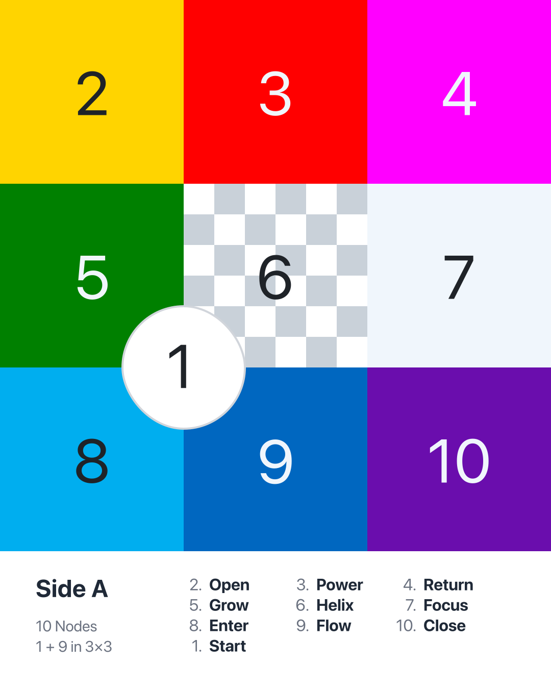
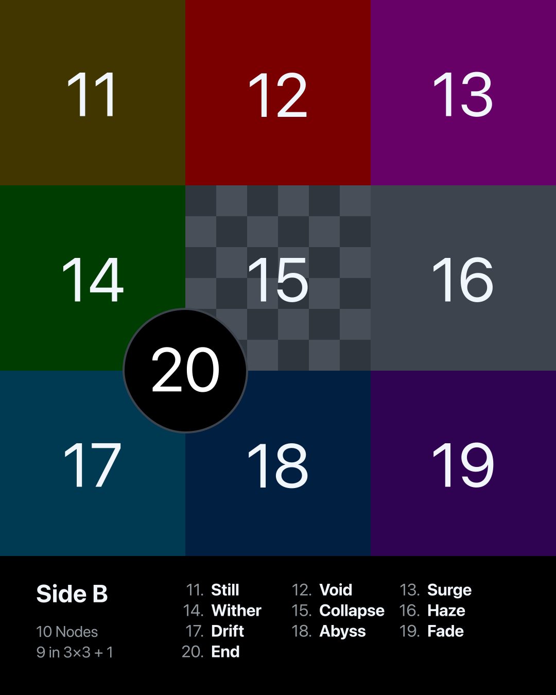

[← Back to Main README](./README.md)

# Playlist

**Playlists using the MTP 1+9+9+1 (20 songs) structure**

Each playlist follows the **MTP 20-node mapping**:

- **Side A (1 intro + 9 tracks)**
- **Side B (9 tracks + 1 outro)**

Node definitions (Start, Open, Power … End) reflect symbolic functions in the sequence.

---

| Side A                                                                                         | Side B                                                                                         |
| ---------------------------------------------------------------------------------------------- | ---------------------------------------------------------------------------------------------- |
|  |  |

↳ [PNG images are available on **Assets**](./ASSETS.md)

---

## 🗺️ Global Playlists

This section introduces playlists curated with the **MTP 1+9+9+1** framework using global music.  
Some were generated entirely by ChatGPT (experimental curation), while others were selected and refined manually.

- **The Beatles / Michael Jackson / Rock / Electronic**: curated entirely by ChatGPT, based on critical reviews, song attributes, and historical influence.
- **Hip Hop / R&B**: curated manually, reflecting personal listening history and contextual understanding of the culture.

---

MTP: The Beatles 1+9+9+1

### MTP: The Beatles 1+9+9+1

**[Apple Music](https://music.apple.com/jp/playlist/mtp-the-beatles-1-9-9-1/pl.u-MDAW8p3t4yXb8y)** | **[Spotify](https://open.spotify.com/playlist/39gD6NvnYMt0a1JVpet1mm?si=446bb0b6a1fc48b5)**

#### Side A

|   # | Node   | Title                         | Reason                                                                |
| --: | ------ | ----------------------------- | --------------------------------------------------------------------- |
|   1 | Start  | Hello, Goodbye                | Playful opener, light contrast of opposites to begin the journey      |
|   2 | Open   | Here Comes the Sun            | Expansive brightness, optimistic openness with iconic melody          |
|   3 | Power  | All You Need Is Love          | Bold anthemic message, concentrated power of universal love           |
|   4 | Return | Revolution                    | Cyclical protest theme, return to raw rock energy                     |
|   5 | Grow   | Get Back                      | Growth through return to basics, upbeat rock groove expanding outward |
|   6 | Helix  | Across the Universe           | Spiraling lyrics, layered cosmic imagery in meditative style          |
|   7 | Focus  | Lucy in the Sky with Diamonds | Sharp psychedelic imagery, focused surreal vision                     |
|   8 | Enter  | Fixing a Hole                 | Entry into introspection, gateway to inner reflection                 |
|   9 | Flow   | Come Together                 | Continuous groove, flowing rhythm with unity message                  |
|  10 | Close  | Something                     | Gentle romantic ballad, emotional closure for Side A                  |

#### Side B

|   # | Node     | Title                        | Reason                                                     |
| --: | -------- | ---------------------------- | ---------------------------------------------------------- |
|  11 | Still    | Blackbird                    | Quiet acoustic stillness, delicate reflection              |
|  12 | Void     | Nowhere Man                  | Emptiness in identity, sparse lyrical void                 |
|  13 | Surge    | Drive My Car                 | Sudden upbeat energy, playful surge with driving rhythm    |
|  14 | Wither   | Yesterday                    | Nostalgic tone, withering sense of lost time               |
|  15 | Collapse | I’m Only Sleeping            | Collapsing energy, dreamlike lethargy                      |
|  16 | Haze     | Strawberry Fields Forever    | Psychedelic haze, blurred surreal textures                 |
|  17 | Drift    | Because                      | Floating harmonies, drifting atmosphere                    |
|  18 | Abyss    | Eleanor Rigby                | Dark orchestral descent, loneliness as emotional abyss     |
|  19 | Fade     | While My Guitar Gently Weeps | Gradual fading sorrow, emotional fade of melancholy        |
|  20 | End      | The End                      | Definitive finale, summative ending statement with closure |

---

MTP: Michael Jackson 1+9+9+1

### MTP: Michael Jackson 1+9+9+1

**[Apple Music](https://music.apple.com/jp/playlist/mtp-michael-jackson-1-9-9-1/pl.u-4Jom5lNsMBy0vB)** | **[Spotify](https://open.spotify.com/playlist/7y3L1Pca7M9zs0TEz2ECk5?si=f7062349425f46e7)**

#### Side A

|   # | Node   | Title                          | Reason                                                               |
| --: | ------ | ------------------------------ | -------------------------------------------------------------------- |
|   1 | Start  | Man in the Mirror              | Reflective opener, personal change sets the journey in motion        |
|   2 | Open   | Heal the World                 | Expansive, humanitarian call, opening the vision to global themes    |
|   3 | Power  | Black or White                 | Energetic anthem of unity, powerful riff and message                 |
|   4 | Return | Wanna Be Startin’ Somethin’    | Cyclical chant, infectious rhythm returning to pure dance energy     |
|   5 | Grow   | Off the Wall                   | Builds joyful momentum, growing freedom of disco groove              |
|   6 | Helix  | Human Nature                   | Spiraling gentle melody, emotional layering in ballad form           |
|   7 | Focus  | Don’t Stop ’Til You Get Enough | Sharp disco focus, precise groove and vocal control                  |
|   8 | Enter  | The Way You Make Me Feel       | Inviting groove, charismatic gateway into MJ’s romantic side         |
|   9 | Flow   | Rock with You                  | Continuous smooth flow, seamless disco soul                          |
|  10 | Close  | Will You Be There              | Orchestral and gospel grandeur, closing Side A with spiritual weight |

#### Side B

|   # | Node     | Title                    | Reason                                                         |
| --: | -------- | ------------------------ | -------------------------------------------------------------- |
|  11 | Still    | You Are Not Alone        | Stillness and intimacy, calm yet emotional presence            |
|  12 | Void     | Stranger in Moscow       | Hollow loneliness, sparse emotional landscape filling the void |
|  13 | Surge    | They Don’t Care About Us | Sudden surge of intensity, driving percussion and social anger |
|  14 | Wither   | She’s Out of My Life     | Withering vulnerability, stripped-down emotional breakdown     |
|  15 | Collapse | Earth Song               | Apocalyptic collapse, dramatic orchestral plea for the planet  |
|  16 | Haze     | In the Closet            | Mysterious haze, sensual yet blurred energy                    |
|  17 | Drift    | Butterflies              | Gentle drifting ballad, floating romantic softness             |
|  18 | Abyss    | Who Is It                | Dark descent, haunting tone, emotional abyss                   |
|  19 | Fade     | Gone Too Soon            | Fading tribute, dissolving gently into memory                  |
|  20 | End      | History                  | Epic finale, summing up legacy and closing with grandeur       |

---

MTP: ’60s Rock 1+9+9+1

### MTP: ’60s Rock 1+9+9+1

**[Apple Music](https://music.apple.com/jp/playlist/mtp-60s-rock-1-9-9-1/pl.u-r2yBe0EF9gaVxg)** | **[Spotify](https://open.spotify.com/playlist/3iaGUT4S0iCsIk9BLnhjtZ?si=ca5e4fb554844658)**

#### Side A

|   # | Node   | Title                         | Artist                      | Reason                                                            |
| --: | ------ | ----------------------------- | --------------------------- | ----------------------------------------------------------------- |
|   1 | Start  | I Want to Hold Your Hand      | The Beatles                 | Joyful introduction, simple and bright energy to open the journey |
|   2 | Open   | California Girls              | The Beach Boys              | Expansive, sunny, celebratory openness with harmonies             |
|   3 | Power  | (I Can’t Get No) Satisfaction | The Rolling Stones          | Iconic riff, raw energy, anthem of youthful power                 |
|   4 | Return | Mr. Tambourine Man            | The Byrds                   | Folk-rock return to lyrical imagery, cyclical and reflective      |
|   5 | Grow   | Like a Rolling Stone          | Bob Dylan                   | Expansive narrative, lyrical growth and cultural milestone        |
|   6 | Helix  | Good Vibrations               | The Beach Boys              | Spiral-like modular structure, layered experimentation            |
|   7 | Focus  | Sunshine of Your Love         | Cream                       | Centered riff, sharp focus on blues-rock intensity                |
|   8 | Enter  | Purple Haze                   | The Jimi Hendrix Experience | Gateway into psychedelic sound, immersive entry point             |
|   9 | Flow   | Light My Fire                 | The Doors                   | Long flowing organ solo, natural unfolding rhythm                 |
|  10 | Close  | A Day in the Life             | The Beatles                 | Epic conclusion for Side A, dramatic orchestral closing           |

#### Side B

|   # | Node     | Title                    | Artist                                           | Reason                                                              |
| --: | -------- | ------------------------ | ------------------------------------------------ | ------------------------------------------------------------------- |
|  11 | Still    | White Room               | Cream                                            | Lyrical stillness, contemplative atmosphere, contrasting dynamics   |
|  12 | Void     | Heroin                   | The Velvet Underground & Nico                    | Sparse, dark minimalism, confronting emptiness                      |
|  13 | Surge    | Whole Lotta Love         | Led Zeppelin                                     | Explosive riff, sudden surge of hard rock power                     |
|  14 | Wither   | Piece of My Heart        | Big Brother & The Holding Company & Janis Joplin | Emotional breakdown, withering intensity and raw passion            |
|  15 | Collapse | Gimme Shelter            | The Rolling Stones                               | Apocalyptic mood, collapsing tension, chaotic soundscape            |
|  16 | Haze     | White Rabbit             | Jefferson Airplane                               | Psychedelic haze, blurred perception, dreamlike crescendo           |
|  17 | Drift    | All Along the Watchtower | The Jimi Hendrix Experience                      | Wandering, drifting guitar lines, sense of movement across space    |
|  18 | Abyss    | The End                  | The Doors                                        | Dark descent, extended exploration into depth and existential abyss |
|  19 | Fade     | Hey Jude                 | The Beatles                                      | Long fade-out, communal dissolving chorus, gradual disappearance    |
|  20 | End      | Sympathy for the Devil   | The Rolling Stones                               | Ritualistic closing, dramatic finale, reflection on humanity’s end  |

---

MTP: ’70s Hard Rock 1+9+9+1

### MTP: ’70s Hard Rock 1+9+9+1

**[Apple Music](https://music.apple.com/jp/playlist/mtp-70s-hard-rock-1-9-9-1/pl.u-XkD09q0F4VW0zV)** | **[Spotify](https://open.spotify.com/playlist/24VrNSviVKw448eSoLdATq?si=8b55c5ec925c4a3c)**

#### Side A

|   # | Node   | Title                                                   | Artist         | Reason                                                              |
| --: | ------ | ------------------------------------------------------- | -------------- | ------------------------------------------------------------------- |
|   1 | Start  | It’s a Long Way to the Top (If You Wanna Rock ’n’ Roll) | AC/DC          | Anthemic beginning, playful yet determined start of a rock journey  |
|   2 | Open   | Rock and Roll                                           | Led Zeppelin   | Celebratory openness, raw energy and expansive chorus               |
|   3 | Power  | Paranoid                                                | Black Sabbath  | Pure power riff, condensed and forceful heavy rock statement        |
|   4 | Return | The Boys Are Back in Town                               | Thin Lizzy     | Cyclical riff, return of camaraderie and shared narrative           |
|   5 | Grow   | Carry On Wayward Son                                    | Kansas         | Expansive build, growing progressive rock layers and harmonies      |
|   6 | Helix  | Stairway to Heaven                                      | Led Zeppelin   | Spiral-like progression, intricate shifts, iconic layered structure |
|   7 | Focus  | Working Man                                             | Rush           | Sharp focus on working-class theme, precise instrumentation         |
|   8 | Enter  | Immigrant Song                                          | Led Zeppelin   | Gateway into mythic energy, immediate entry with powerful scream    |
|   9 | Flow   | Radar Love                                              | Golden Earring | Flowing groove, long continuous ride, sense of movement             |
|  10 | Close  | Dream On                                                | Aerosmith      | Emotional closure, reflective melody, timeless finale for Side A    |

#### Side B

|   # | Node     | Title                   | Artist           | Reason                                                              |
| --: | -------- | ----------------------- | ---------------- | ------------------------------------------------------------------- |
|  11 | Still    | More Than a Feeling     | Boston           | Reflective stillness, steady nostalgia and melodic calm             |
|  12 | Void     | (Don’t Fear) The Reaper | Blue Öyster Cult | Sparse atmosphere, contemplation of emptiness and mortality         |
|  13 | Surge    | Highway Star            | Deep Purple      | Sudden explosive riff, unstoppable surge of hard rock energy        |
|  14 | Wither   | Wishing Well            | Free             | Melancholic tone, withering reflection, sense of loss               |
|  15 | Collapse | Won’t Get Fooled Again  | The Who          | Collapsing structure, dramatic tension, revolutionary breakdown     |
|  16 | Haze     | In Trance               | Scorpions        | Misty, blurred soundscape, hazy mood in early hard rock             |
|  17 | Drift    | Fly by Night            | Rush             | Wandering movement, drifting sense of exploration and departure     |
|  18 | Abyss    | Death Walks Behind You  | Atomic Rooster   | Dark, heavy descent into abyssal tones, haunting atmosphere         |
|  19 | Fade     | Surrender               | Cheap Trick      | Playful but fading, dissolving energy, tongue-in-cheek farewell     |
|  20 | End      | Highway to Hell         | AC/DC            | Definitive closing, dramatic anthem of finality, iconic rock ending |

---

MTP: ’80s Hard Rock 1+9+9+1

### MTP: ’80s Hard Rock 1+9+9+1

**[Apple Music](https://music.apple.com/jp/playlist/mtp-80s-hard-rock-1-9-9-1/pl.u-MDAWKB9u4yXb8y)** | **[Spotify](https://open.spotify.com/playlist/1vFyAdNztC02RBNDAM8rED?si=e9c6134174474f52)**

#### Side A

|   # | Node   | Title                 | Artist                      | Reason                                                                 |
| --: | ------ | --------------------- | --------------------------- | ---------------------------------------------------------------------- |
|   1 | Start  | Back in Black         | AC/DC                       | Triumphant return, bold riff opening, iconic restart for hard rock     |
|   2 | Open   | I Love Rock ’N Roll   | Joan Jett & The Blackhearts | Direct declaration, open invitation to rock spirit, sing-along energy  |
|   3 | Power  | Crazy Train           | Ozzy Osbourne               | Driving riff, explosive vocal energy, unrelenting power                |
|   4 | Return | Here I Go Again ’87   | Whitesnake                  | Cyclical theme of return, anthem of resilience and reflection          |
|   5 | Grow   | Livin’ on a Prayer    | Bon Jovi                    | Builds into stadium chorus, inspirational growth and collective spirit |
|   6 | Helix  | Tom Sawyer            | Rush                        | Complex spiraling rhythms, layered progressive rock structure          |
|   7 | Focus  | Eye of the Tiger      | Survivor                    | Sharp motivational focus, concentrated anthem of determination         |
|   8 | Enter  | Welcome to the Jungle | Guns N’ Roses               | A visceral plunge into chaos, dangerous and thrilling entry point      |
|   9 | Flow   | Rock of Ages          | Def Leppard                 | Anthemic continuous flow, celebratory energy and rhythm                |
|  10 | Close  | Still of the Night    | Whitesnake                  | Dramatic ballad-like closure, blending intensity with melodic finale   |

#### Side B

|   # | Node     | Title                   | Artist      | Reason                                                                 |
| --: | -------- | ----------------------- | ----------- | ---------------------------------------------------------------------- |
|  11 | Still    | The Zoo                 | Scorpions   | Slow, heavy groove, sense of still urban tension                       |
|  12 | Void     | Hells Bells             | AC/DC       | Sparse bell intro, looming emptiness before the surge                  |
|  13 | Surge    | Run to the Hills        | Iron Maiden | Fast galloping rhythm, sudden surge of metal energy                    |
|  14 | Wither   | 18 and Life             | Skid Row    | Story of downfall, withering youth and tragedy                         |
|  15 | Collapse | For Whom the Bell Tolls | Metallica   | Crushing heaviness, collapsing riffs, apocalyptic tone                 |
|  16 | Haze     | She Sells Sanctuary     | The Cult    | Mystical haze, swirling guitars, blurred gothic energy                 |
|  17 | Drift    | Wasted Years            | Iron Maiden | Reflective drift, wandering through time and nostalgia                 |
|  18 | Abyss    | Holy Diver              | Dio         | Dark descent into mythic depth, abyssal heavy metal atmosphere         |
|  19 | Fade     | Wanted Dead or Alive    | Bon Jovi    | Acoustic intro fading into anthem, dissolving sense of the outlaw life |
|  20 | End      | The Last in Line        | Dio         | Epic conclusion, dramatic finale of destiny and power                  |

---

MTP: ’80s Hip Hop 1+9+9+1

### MTP: ’80s Hip Hop 1+9+9+1

**[Apple Music](https://music.apple.com/jp/playlist/mtp-80s-hip-hop-1-9-9-1/pl.u-MDAW64qT4yXb8y)** | **[Spotify](https://open.spotify.com/playlist/3WjgJEp1GAXuc7q1KvbCAN?si=f1d00a11855a40b6)**

#### Side A

|   # | Node   | Title              | Artist                                 | Reason                                                            |
| --: | ------ | ------------------ | -------------------------------------- | ----------------------------------------------------------------- |
|   1 | Start  | Paid in Full       | Eric B. & Rakim                        | Foundational track, definitive start of golden age hip-hop        |
|   2 | Open   | My Philosophy      | Boogie Down Productions                | Expansive lyrical vision, opening perspective on social awareness |
|   3 | Power  | I’m Bad            | LL Cool J                              | Bold declaration of strength, raw power and confidence            |
|   4 | Return | Planet Rock        | Afrika Bambaataa & The Soulsonic Force | Cyclical electro-funk return, roots of hip-hop’s global rhythm    |
|   5 | Grow   | Top Billin’        | Audio Two                              | Minimal yet growing influence, iconic stripped-down style         |
|   6 | Helix  | The Message        | Grandmaster Flash & The Furious Five   | Spiraling storytelling, layered urban commentary                  |
|   7 | Focus  | It’s Tricky        | Run‐D.M.C.                             | Focused high energy, precise rhythmic delivery                    |
|   8 | Enter  | So What Cha Sayin’ | EPMD                                   | Gateway to funk-driven groove, inviting flow                      |
|   9 | Flow   | Smooth Operator    | Big Daddy Kane                         | Smooth, continuous lyrical flow, effortless rhythm                |
|  10 | Close  | Hey Young World    | Slick Rick                             | Reflective closure, storytelling advice with moral undertone      |

#### Side B

|   # | Node     | Title                                 | Artist                  | Reason                                                                |
| --: | -------- | ------------------------------------- | ----------------------- | --------------------------------------------------------------------- |
|  11 | Still    | Basketball                            | Kurtis Blow             | Playful still groove, steady rhythm of early hip-hop culture          |
|  12 | Void     | Rapper’s Delight (Remix Long Version) | The Sugarhill Gang      | Expansive emptiness filled with long grooves, pioneering yet spacious |
|  13 | Surge    | Roxanne’s Revenge                     | Roxanne Shanté          | Sudden lyrical attack, sharp surge of battle rap energy               |
|  14 | Wither   | South Bronx                           | Boogie Down Productions | Raw tone, gritty withering critique in Bronx battle history           |
|  15 | Collapse | La-Di-da-Di (Live 1984)               | Doug E. Fresh           | Beatbox minimalism collapsing into playful improvisation              |
|  16 | Haze     | The Bridge                            | MC Shan                 | Historical haze, blurred storytelling within battle rap context       |
|  17 | Drift    | Nobody Beats the Biz                  | Biz Markie              | Wandering humor, drifting playful charm                               |
|  18 | Abyss    | Colors                                | Ice-T                   | Dark narrative, descent into gang realities, abyssal themes           |
|  19 | Fade     | Life Is... Too $hort                  | Too $hort               | Fading narrative of street life, dissolving into everyday realism     |
|  20 | End      | It Takes Two                          | Rob Base & DJ EZ Rock   | Explosive finale, definitive party closer, iconic collaboration       |

---

MTP: ’90s Hip Hop 1+9+9+1

### MTP: ’90s Hip Hop 1+9+9+1

**[Apple Music](https://music.apple.com/jp/playlist/mtp-90s-hip-hop-1-9-9-1/pl.u-55D6lRVTY91ej9)** | **[Spotify](https://open.spotify.com/playlist/4QnOKXakj1NlYmYLcwpgVA?si=4d198ee6a8304444)**

#### Side A

|   # | Node   | Title                                    | Artist               | Reason                                                                  |
| --: | ------ | ---------------------------------------- | -------------------- | ----------------------------------------------------------------------- |
|   1 | Start  | Check the Rhime                          | A Tribe Called Quest | Smooth jazzy intro, classic beginning of conscious rap                  |
|   2 | Open   | I Get Around (feat. Digital Underground) | 2Pac                 | Playful and expansive energy, open celebration of fun and style         |
|   3 | Power  | Fight the Power                          | Public Enemy         | Explosive political anthem, raw power and defiance                      |
|   4 | Return | Player’s Ball                            | OutKast              | Returning to Southern roots, festive yet reflective vibe                |
|   5 | Grow   | AmeriKKKa’s Most Wanted                  | Ice Cube             | Expansive social critique, strong voice of growth in West Coast rap     |
|   6 | Helix  | Nuthin’ but a “G” Thang                  | Dr. Dre              | Spiraling G-funk groove, cyclical laid-back yet sharp                   |
|   7 | Focus  | The World Is Yours                       | Nas                  | Introspective precision, lyrical focus on ambition and vision           |
|   8 | Enter  | C.R.E.A.M.                               | Wu-Tang Clan         | Gateway to street philosophy, memorable hook invites deeper exploration |
|   9 | Flow   | Juicy                                    | The Notorious B.I.G. | Smooth narrative flow, autobiographical rise with seamless rhythm       |
|  10 | Close  | Dead Presidents II                       | Jay-Z                | Reflective closure, serious tone, money motif wraps Side A              |

#### Side B

|   # | Node     | Title                                                       | Artist                  | Reason                                                                |
| --: | -------- | ----------------------------------------------------------- | ----------------------- | --------------------------------------------------------------------- |
|  11 | Still    | How Many MC’s…                                              | Black Moon              | Minimal beats, calm stillness yet grounded lyrical strength           |
|  12 | Void     | How Could I Kill a Man                                      | Cypress Hill            | Dark emptiness, harsh street narrative with space in sound            |
|  13 | Surge    | Come Clean                                                  | Jeru the Damaja         | Sudden lyrical intensity, hard-hitting surge with raw beats           |
|  14 | Wither   | Livin’ Proof                                                | Group Home              | Fragile storytelling, decaying hope, withering tone of struggle       |
|  15 | Collapse | Shook Ones, Pt. II                                          | Mobb Deep               | Collapsing tension, haunting beat, sense of inevitable downfall       |
|  16 | Haze     | Dwyck (feat. Nice & Smooth)                                 | Gang Starr              | Jazzy haze, playful yet blurred wordplay                              |
|  17 | Drift    | Ice Cream (feat. Ghostface Killah, Method Man & Cappadonna) | Raekwon                 | Drifting groove, laid-back storytelling, floating ensemble vibe       |
|  18 | Abyss    | Tonight’s Da Night                                          | Redman                  | Dark humor, abyss of wild freestyle energy                            |
|  19 | Fade     | They Reminisce Over You (T.R.O.Y.)                          | Pete Rock & C.L. Smooth | Gentle fading nostalgia, tribute dissolving into memory               |
|  20 | End      | Flava In Ya Ear (Remix)                                     | Craig Mack              | Explosive posse cut, definitive end note of classic era collaboration |

---

MTP: ’90s R&B 1+9+9+1

### MTP: ’90s R&B 1+9+9+1

**[Apple Music](https://music.apple.com/jp/playlist/mtp-90s-r-b-1-9-9-1/pl.u-06oxbE6FXdyxVd)** | **[Spotify](https://open.spotify.com/playlist/20VvqVoTU6JUNsnl1KOGxH?si=3e47e96b381a4ec3)**

#### Side A — Female

|   # | Node   | Title                             | Artist          | Reason                                                                   |
| --: | ------ | --------------------------------- | --------------- | ------------------------------------------------------------------------ |
|   1 | Start  | Fantasy (feat. Ol’ Dirty Bastard) | Mariah Carey    | Playful and uplifting start, bridging pop and hip-hop for a bright entry |
|   2 | Open   | Say My Name                       | Destiny’s Child | Expansive harmonies, commanding openness, strong R&B anthem              |
|   3 | Power  | That’s the Way Love Goes          | Janet Jackson   | Confident groove, powerful yet sensual energy                            |
|   4 | Return | Right Here (Human Nature Mix)     | SWV             | Returning loop with Michael Jackson sample, cyclical familiarity         |
|   5 | Grow   | You Used to Love Me               | Faith Evans     | Building emotional intensity, expressive vocal growth                    |
|   6 | Helix  | Real Love                         | Mary J. Blige   | Spiral of hip-hop beats and soul vocals, iconic fusion                   |
|   7 | Focus  | The Boy Is Mine                   | Brandy & Monica | Lyrical duel, sharp focus on rivalry and vocal interplay                 |
|   8 | Enter  | Back & Forth                      | Aaliyah         | Inviting groove, gateway into smooth 90s R&B                             |
|   9 | Flow   | Waterfalls                        | TLC             | Continuous melodic flow, socially conscious message with smooth rhythm   |
|  10 | Close  | You’re Makin’ Me High             | Toni Braxton    | Sultry closing for Side A, deep and emotional atmosphere                 |

#### Side B — Male

|   # | Node     | Title                   | Artist         | Reason                                                        |
| --: | -------- | ----------------------- | -------------- | ------------------------------------------------------------- |
|  11 | Still    | Twisted                 | Keith Sweat    | Steady quiet storm vibe, calm stillness with emotional depth  |
|  12 | Void     | Come & Talk to Me       | Jodeci         | Sparse instrumentation, emotional longing filling the void    |
|  13 | Surge    | Pony                    | Ginuwine       | Explosive sensuality, sudden surge of futuristic R&B sound    |
|  14 | Wither   | Your Body’s Callin’     | R. Kelly       | Darker undertone, decaying mood beneath seductive lyrics      |
|  15 | Collapse | Don’t Wanna Be a Player | Joe            | Collapsing bravado, vulnerability under smooth groove         |
|  16 | Haze     | Cupid                   | 112            | Dreamlike haze, sweet harmonies with blurred romantic imagery |
|  17 | Drift    | Nice & Slow             | Usher          | Gentle drifting tempo, wandering emotional landscape          |
|  18 | Abyss    | Can We Talk             | Tevin Campbell | Emotional depth, sinking into vulnerability and yearning      |
|  19 | Fade     | Before I Let You Go     | Blackstreet    | Fading ballad, dissolving into melancholy farewell            |
|  20 | End      | A Song for Mama         | Boyz II Men    | Definitive ending, heartfelt dedication and emotional closure |

---

MTP: Y2K Hip Hop 1+9+9+1

### MTP: Y2K Hip Hop 1+9+9+1

**[Apple Music](https://music.apple.com/jp/playlist/mtp-y2k-hip-hop-1-9-9-1/pl.u-EdAV86GCXbNmrb)** | **[Spotify](https://open.spotify.com/playlist/4XkRbzCGZDHRoOqVRsIH3u?si=1c6d77370d4048da)**

#### Side A

|   # | Node   | Title                               | Artist        | Reason                                                          |
| --: | ------ | ----------------------------------- | ------------- | --------------------------------------------------------------- |
|   1 | Start  | Get Ur Freak On                     | Missy Elliott | Playful and innovative opener, eccentric beat sets the stage    |
|   2 | Open   | Break Ya Neck                       | Busta Rhymes  | Expansive rapid-fire delivery, explosive openness of energy     |
|   3 | Power  | Who’s That Girl?                    | Eve           | Bold anthem, powerful declaration of presence                   |
|   4 | Return | E.I.                                | Nelly         | Southern party groove, cyclical chant-driven return             |
|   5 | Grow   | Nas Is Like                         | Nas           | Complex lyrical growth, intricate bars expanding artistry       |
|   6 | Helix  | Izzo (H.O.V.A.)                     | Jay-Z         | Spiraling wordplay, celebratory looping hook                    |
|   7 | Focus  | How Many Licks? (feat. Sisqó)       | Lil’ Kim      | Sharp, playful focus on explicit lyricism and charisma          |
|   8 | Enter  | We Right Here                       | DMX           | Aggressive gateway, immediate intensity drawing the listener in |
|   9 | Flow   | Always on Time (feat. Ashanti)      | Ja Rule       | Smooth duet flow, balanced interplay between voices             |
|  10 | Close  | The Next Episode (feat. Snoop Dogg) | Dr. Dre       | Classic west coast closer, iconic hook wrapping up Side A       |

#### Side B

|   # | Node     | Title                                           | Artist                       | Reason                                                                 |
| --: | -------- | ----------------------------------------------- | ---------------------------- | ---------------------------------------------------------------------- |
|  11 | Still    | Still D.R.E. (feat. Snoop Dogg)                 | Dr. Dre                      | Steady piano motif, calm yet commanding stillness                      |
|  12 | Void     | Grindin’                                        | Clipse                       | Sparse beat, hollow minimalism creating space and emptiness            |
|  13 | Surge    | I Don’t Give A… (feat. Mystikal & Krayzie Bone) | Lil Jon & The East Side Boyz | Sudden crunk explosion, aggressive surge of southern energy            |
|  14 | Wither   | Young’n                                         | Fabolous                     | Street bravado with fading innocence, withering bravado                |
|  15 | Collapse | Big Pimpin’ (feat. UGK)                         | Jay-Z                        | Lavish sound collapsing into excess, decadent tone                     |
|  16 | Haze     | Ha                                              | Juvenile                     | Murky repetitive phrasing, hazy bounce defining New Orleans rap        |
|  17 | Drift    | The Way I Am                                    | Eminem                       | Wandering self-reflection, drifting between defiance and vulnerability |
|  18 | Abyss    | Bad Boyz                                        | Shyne feat. Barrington Levy  | Dark, cavernous tone, descent into gritty narrative                    |
|  19 | Fade     | So Fresh, So Clean                              | OutKast                      | Smooth fade of style, dissolving into playful coolness                 |
|  20 | End      | Gravel Pit                                      | Wu-Tang Clan                 | Chaotic and theatrical finale, cinematic end note of the era           |

---

MTP: ’90s Electronic 1+9+9+1

### MTP: ’90s Electronic 1+9+9+1

**[Apple Music](https://music.apple.com/jp/playlist/mtp-90s-electronic-1-9-9-1/pl.u-55D6MGKCY91ej9)** | **[Spotify](https://open.spotify.com/playlist/4jB9VIj0ZLXCtW1N6I1or6?si=acd7e1c0672c480f)**

#### Side A

| #   | Node   | Title                 | Artist                     | Reason                                                      |
| --- | ------ | --------------------- | -------------------------- | ----------------------------------------------------------- |
| 1   | Start  | La femme d’argent     | Air                        | Dreamlike intro, smooth atmosphere that sets the beginning  |
| 2   | Open   | Around the World      | Daft Punk                  | Expansive repetition, playful openness, iconic house groove |
| 3   | Power  | Block Rockin’ Beats   | The Chemical Brothers      | Explosive breakbeats, strong energy driver                  |
| 4   | Return | Praise You            | Fatboy Slim                | Return to fun sample-based dance, uplifting loop            |
| 5   | Grow   | Born Slippy (Nuxx)    | Underworld                 | Builds from minimal to euphoric, anthem of rave culture     |
| 6   | Helix  | Flutter               | Autechre                   | Spiral-like structures, constantly morphing patterns        |
| 7   | Focus  | Papua New Guinea      | The Future Sound of London | Sharp sonic focus, immersive layering                       |
| 8   | Enter  | Teardrop              | Massive Attack             | Inviting entrance with haunting vocals, trip-hop gateway    |
| 9   | Flow   | Halcyon and On and On | Orbital                    | Continuous trance-like flow, emotional resonance            |
| 10  | Close  | Porcelain             | Moby                       | Gentle closure of Side A, melodic fragility                 |

#### Side B

| #   | Node     | Title                                | Artist            | Reason                                              |
| --- | -------- | ------------------------------------ | ----------------- | --------------------------------------------------- |
| 11  | Still    | Sour Times                           | Portishead        | Stillness, noir atmosphere, reflective trip-hop     |
| 12  | Void     | Xtal                                 | Aphex Twin        | Sparse textures, hollow spaces, ambient emptiness   |
| 13  | Surge    | Firestarter                          | The Prodigy       | Sudden intensity, aggressive burst of energy        |
| 14  | Wither   | Black Steel                          | Tricky            | Dark, decaying mood, political tension              |
| 15  | Collapse | Plasticity                           | Plastikman        | Long, minimal techno collapsing inward, hypnotic    |
| 16  | Haze     | Turquoise Hexagon Sun                | Boards of Canada  | Blurry, hazy nostalgia, mist-like textures          |
| 17  | Drift    | Valley of the Shadows                | Origin Unknown    | Floating drum & bass atmosphere, drifting vibe      |
| 18  | Abyss    | Modus Operandi                       | Photek            | Deep, shadowy jungle track, technical abyss         |
| 19  | Fade     | Les Nuits                            | Nightmares on Wax | Slowly dissolving downtempo, jazzy fade-out feeling |
| 20  | End      | Lonely Soul (feat. Richard Ashcroft) | UNKLE             | Epic closing, cinematic and era-defining finale     |

---

MTP: ’00s Electronic 1+9+9+1

### MTP: ’00s Electronic 1+9+9+1

**[Apple Music](https://music.apple.com/jp/playlist/mtp-00s-electronic-1-9-9-1/pl.u-yZyVK71tzg64Eg)** | **[Spotify](https://open.spotify.com/playlist/03UsF4WHP9iKUPaQNU4YYV?si=1cde7a2164c8411e)**

#### Side A

| #   | Node   | Title                                   | Artist           | Reason                                                           |
| --- | ------ | --------------------------------------- | ---------------- | ---------------------------------------------------------------- |
| 1   | Start  | In a Beautiful Place Out In the Country | Boards of Canada | Quiet introduction, introspective mood fitting for a "beginning" |
| 2   | Open   | Cherry Blossom Girl                     | Air              | Light and expansive sound, lyrics with openness                  |
| 3   | Power  | D.A.N.C.E                               | Justice          | Clear rhythm and anthemic quality, strong drive                  |
| 4   | Return | House of Jealous Lovers                 | The Rapture      | Rock/dance revival, repetitive riff                              |
| 5   | Grow   | Heartbeats                              | The Knife        | Expansive synth-pop emotion, melody that grows                   |
| 6   | Helix  | Archangel                               | Burial           | Spiral-like sample layering, rotational UK garage feel           |
| 7   | Focus  | Hands                                   | Four Tet         | Intricate beats, constructed with sharp focus                    |
| 8   | Enter  | Disco Infiltrator                       | LCD Soundsystem  | Groovy and inviting, mood of entry                               |
| 9   | Flow   | Mandarine Girl                          | Booka Shade      | Flowing rhythm and progression, club-like groove                 |
| 10  | Close  | Frontier Psychiatrist                   | The Avalanches   | Humorous collage of samples, fitting A-side closure              |

#### Side B

| #   | Node     | Title                              | Artist           | Reason                                                     |
| --- | -------- | ---------------------------------- | ---------------- | ---------------------------------------------------------- |
| 11  | Still    | Keep the Streets Empty For Me      | Fever Ray        | Sense of stillness and introspection, space in the sound   |
| 12  | Void     | Hyph Mngo                          | Joy Orbison      | Minimal and cutting-edge, UK dubstep using emptiness       |
| 13  | Surge    | One More Time                      | Daft Punk        | Sudden elevation, explosive dancefloor energy              |
| 14  | Wither   | Silent Shout                       | The Knife        | Cold and withering emotional tone, dark atmosphere         |
| 15  | Collapse | Blood on My Hands (Villalobos Mix) | Shackleton       | Long hypnotic beat suggesting collapse, sinking repetition |
| 16  | Haze     | Over and Over                      | Hot Chip         | Repetitive pop sensibility, hazy and ambiguous feel        |
| 17  | Drift    | Vacuum Boogie                      | Floating Points  | Gentle drifting sensation, jazzy wandering groove          |
| 18  | Abyss    | If I Had a Heart                   | Fever Ray        | Dark, sinking lyrics and sound, imagery of depth           |
| 19  | Fade     | Music Is Math                      | Boards of Canada | Gradually dissolving, floating abstraction, fading out     |
| 20  | End      | Paper Planes                       | M.I.A.           | Era-defining closing track, resonance and message          |

---

## 🗾 Japan Playlists

I also publish special playlists of Japanese songs.  
Since I carefully classify Japanese lyrics and emotional expressions, each node’s characteristics may be easier to imagine.  
Among them, Hikaru Utada’s works are especially suitable for classification, and I have organized them into a 40-song structure:  
**1+9 (A1) + 9+1 (B1) + 1+9 (A2) + 9+1 (B2)**.

---

MTP: ’70s–’80s Emotion of Japan 1+9+9+1

### MTP: ’70s–’80s Emotion of Japan 1+9+9+1

**[Apple Music](https://music.apple.com/jp/playlist/mtp-70-80s-emotion-of-japan-1-9-9-1/pl.u-XkD08MrH4VW0zV)** | **[Spotify](https://open.spotify.com/playlist/3NewG2L6mmETzKrFSeG0eH?si=9cd4a0e2898f4632)**

#### Side A — Female

|   # | Node   | Title              | Artist           | Reason                                                                                    |
| --: | ------ | ------------------ | ---------------- | ----------------------------------------------------------------------------------------- |
|   1 | Start  | ウエディング・ベル | Sugar            | The shocking lyrics satirizing marriage give a strong impression as the opening.          |
|   2 | Open   | ひなげしの花       | アグネス・チャン | The transparent voice and simple lyrics symbolize the purity of being “opened.”           |
|   3 | Power  | 青い珊瑚礁         | 松田聖子         | Refreshing idol-like energy makes it a powerful track representing the 1980s.             |
|   4 | Return | UFO                | ピンク・レディー | The bright refrain and addictive phrases evoke the sense of “returning.”                  |
|   5 | Grow   | 不思議なピーチパイ | 竹内まりや       | The sophistication of city pop symbolizes growth and maturity.                            |
|   6 | Helix  | 海を見ていた午後   | 荒井由実         | The spiraling melody and vivid scenery evoke a sense of spiral-like expansion.            |
|   7 | Focus  | 横須賀ストーリー   | 山口百恵         | The dramatic singing creates a sharp focal point, drawing the listener in.                |
|   8 | Enter  | セカンド・ラブ     | 中森明菜         | A delicate and emotional ballad resonates like an entrance into the inner world.          |
|   9 | Flow   | 川の流れのように   | 美空ひばり       | The ever-flowing melody symbolizes “flow” and stands as an iconic song of Japanese music. |
|  10 | Close  | 津軽海峡・冬景色   | 石川さゆり       | A poignant enka with harsh emotions, perfect for closing Side A gracefully.               |

#### Side B — Male

|   # | Node     | Title                                      | Artist           | Reason                                                                                  |
| --: | -------- | ------------------------------------------ | ---------------- | --------------------------------------------------------------------------------------- |
|  11 | Still    | まつり                                     | 北島三郎         | The majestic and unwavering vocals embody the powerful stillness of “silence.”          |
|  12 | Void     | ドリフの早口ことば                         | ザ・ドリフターズ | The tongue-twister humorously reflects “emptiness” and absurdity.                       |
|  13 | Surge    | ツッパリ High School Rock’n Roll（登校編） | 横浜銀蝿         | The sudden and explosive energy makes it a perfect symbol of “surge.”                   |
|  14 | Wither   | 関白宣言                                   | さだまさし       | Humorously singing male stereotypes, it reflects the “withering” of outdated values.    |
|  15 | Collapse | 2 億 4 千万の瞳（エキゾチック・ジャパン）  | 郷ひろみ         | The flashy arrangement and excessive performance radiate a festive sense of “collapse.” |
|  16 | Haze     | 君は天然色                                 | 大滝詠一         | Nostalgia and dreamy sounds evoke a hazy atmosphere of “haze.”                          |
|  17 | Drift    | ブランデーグラス                           | 石原裕次郎       | The relaxed vocals and mature aftertaste spread like gentle “drifting.”                 |
|  18 | Abyss    | よこはま・たそがれ                         | 五木ひろし       | The deep melancholy and loneliness echo as if sinking into an “abyss.”                  |
|  19 | Fade     | 贈る言葉                                   | 海援隊           | Gentle farewell lyrics feel as if quietly fading out.                                   |
|  20 | End      | ENDLESS RAIN                               | X Japan          | A dramatic and grand ballad, perfectly symbolizing the “end.”                           |

---

MTP: ’90s Emotion of Japan 1+9+9+1

### MTP: ’90s Emotion of Japan 1+9+9+1

**[Apple Music](https://music.apple.com/jp/playlist/mtp-90s-emotion-of-japan-1-9-9-1/pl.u-4Jom5N2sMBy0vB)** | **[Spotify](https://open.spotify.com/playlist/4J9A7yicWkJ0jsB9ZREIG9?si=77c20d68b48d46dc)**

#### Side A

|   # | Node   | Title                  | Artist           | Reason                                                                                     |
| --: | ------ | ---------------------- | ---------------- | ------------------------------------------------------------------------------------------ |
|   1 | Start  | HOWEVER                | GLAY             | A heartrending melody and universal lyrics symbolize the start of an emotional journey.    |
|   2 | Open   | DEPARTURES             | globe            | The grand intro and liberating vocals strongly convey a sense of “departure” and openness. |
|   3 | Power  | LOVE PHANTOM           | B’z              | Intense development and explosive sound make it a fitting symbol of “power.”               |
|   4 | Return | Shake                  | DOUBLE           | The R&B rhythm and catchiness evoke the joy of “returning.”                                |
|   5 | Grow   | ロビンソン             | スピッツ         | The transparent melody and poignancy evoke inner growth and the expansion of a journey.    |
|   6 | Helix  | 春よ、来い             | 松任谷由実       | A melody about seasonal cycles and hope symbolizes spiral-like circulation and renewal.    |
|   7 | Focus  | 負けないで             | ZARD             | A straightforward message and powerful vocals convey the strength of concentrated “focus.” |
|   8 | Enter  | イージュー ★ ライダー  | 奥田民生         | The lighthearted and free atmosphere creates an openness like an “entrance” to life.       |
|   9 | Flow   | つつみ込むように・・・ | MISIA            | Smooth melody and embracing vocals fill the heart like a flowing stream.                   |
|  10 | Close  | LOVE LOVE LOVE         | DREAMS COME TRUE | A gentle love song that leaves lingering resonance, perfect for closing Side A.            |

#### Side B

|   # | Node     | Title                        | Artist               | Reason                                                                                     |
| --: | -------- | ---------------------------- | -------------------- | ------------------------------------------------------------------------------------------ |
|  11 | Still    | winter fall                  | L’Arc〜en〜Ciel      | A melody reminiscent of winter’s stillness conveys the atmosphere of “silence.”            |
|  12 | Void     | ズルい女                     | シャ乱 Q             | Comical yet empty lyrics humorously express a sense of “void.”                             |
|  13 | Surge    | アジアの純真                 | PUFFY                | Explosive pop energy and momentum embody the rising force of a “surge.”                    |
|  14 | Wither   | 情熱                         | UA                   | The bewitching and intense atmosphere carries an aftertaste of “wither,” like burning out. |
|  15 | Collapse | 名もなき詩                   | Mr.Children          | Introspective and weighty lyrics resonate as though containing emotional “collapse.”       |
|  16 | Haze     | ここでキスして               | 椎名林檎             | A sensual and ambiguous worldview, like being shrouded in mist, aligns with “haze.”        |
|  17 | Drift    | やさしい気持ち               | Chara                | Gentle voice and melody give a drifting sense of comfort.                                  |
|  18 | Abyss    | 愛の言霊 ~Spiritual Message~ | サザンオールスターズ | Profound and spiritual messages spread out as if peering into the “abyss.”                 |
|  19 | Fade     | 君がいるだけで               | 米米 CLUB            | Gentle and calm melody creates a feeling of quietly dissolving into “fade.”                |
|  20 | End      | ら・ら・ら                   | 大黒摩季             | A powerful yet warm message makes it a fitting closure for the “end.”                      |

---

MTP: J-Rap 力学 1+9+9+1

### MTP: J-Rap 力学 1+9+9+1

**[Apple Music](https://music.apple.com/jp/playlist/mtp-j-rap-%E5%8A%9B%E5%AD%A6-1-9-9-1/pl.u-yZyVBDlIzg64Eg)** | **[Spotify](https://open.spotify.com/playlist/5NPwWxX6ihLJIm5zB6JAi6?si=79683473d4e743b2)**

#### Side A

|   # | Node   | Title                        | Artist                       | Reason                                                                                      |
| --: | ------ | ---------------------------- | ---------------------------- | ------------------------------------------------------------------------------------------- |
|   1 | Start  | B-BOY イズム                 | RHYMESTER                    | An anthem presenting the spirit of Japanese rap, fitting for the story’s beginning.         |
|   2 | Open   | 病む街                       | Microphone Pager             | Lyrics capturing the reality of disasters and social anxiety provide an “open” perspective. |
|   3 | Power  | Neva Enuff                   | ZEBBRA                       | Hard rap and forceful flow symbolize “power.”                                               |
|   4 | Return | Kawasaki Drift               | BAD HOP                      | A viral sound rooted in the local scene embodies the meaning of “return.”                   |
|   5 | Grow   | NITRO MICROPHONE UNDERGROUND | NITRO MICROPHONE UNDERGROUND | The energy of group rap and the density of sound symbolize the “growth” of the scene.       |
|   6 | Helix  | チーム友達                   | 千葉雄喜                     | A hook repeated like a spiral, with diffusion and expansion, aligns with “helix.”           |
|   7 | Focus  | 公開処刑                     | キングギドラ                 | Sharp critique functions as a concentrated “focus.”                                         |
|   8 | Enter  | Fate                         | ANARCHY                      | Heavy beats and street-driven force resonate as though opening the “entrance.”              |
|   9 | Flow   | AREA AREA                    | OZROSAURUS                   | Flowing delivery and atmosphere embody the sense of “flow.”                                 |
|  10 | Close  | 証言                         | LAMP EYE                     | A monumental track in Japanese rap history, carrying the weight to close the side.          |

#### Side B

|   # | Node     | Title                     | Artist       | Reason                                                                             |
| --: | -------- | ------------------------- | ------------ | ---------------------------------------------------------------------------------- |
|  11 | Still    | おはよう日本              | 般若         | A plain, everyday portrayal embodies a sense of “stillness.”                       |
|  12 | Void     | 邦楽界                    | ラッパ我リヤ | Lyrics that critique the music industry resonate with “void” and emptiness.        |
|  13 | Surge    | 悪党の詩                  | D.O.         | Sharp lyrics rise with comical looseness, symbolizing a “surge.”                   |
|  14 | Wither   | ジャンガル                | 韻踏合組合   | A withered jungle acts as a metaphor for “wither” yet also hints at growth.        |
|  15 | Collapse | Shock Shock               | Awich        | Intense presence and shocking expression embody the explosive force of “collapse.” |
|  16 | Haze     | Bad Waka-Danna In Da Club | Tokona-X     | Lyrics of dangerous nights, hazy to the point of losing memory, align with “haze.” |
|  17 | Drift    | Floatin’                  | 舐達磨       | A mood that drifts as though freed from gravity or after a shock.                  |
|  18 | Abyss    | BIG BLUE                  | SHAKKAZOMBIE | Deep blue, heavy beats, and a dreamy atmosphere evoke the “abyss.”                 |
|  19 | Fade     | 花と雨                    | SEEDA        | Lyrics flow quietly like rain, fading into “fade.”                                 |
|  20 | End      | Get Light                 | KANDYTOWN    | Refined urban sound stylishly closes the narrative as the “end.”                   |

---

MTP: globe — From the 2025 Best Album 1+9+9+1

### MTP: globe — From the 2025 Best Album 1+9+9+1

**[Apple Music](https://music.apple.com/jp/playlist/mtp-globe-from-the-2025-best-album-1-9-9-1/pl.u-EdAVZ2GTXbNmrb)** | **[Spotify](https://open.spotify.com/playlist/4KrJeDqLiPL4qmKx2j7giu?si=2388ed7eab0a466f)**

#### Side A

|   # | Node   | Title                      | Reason                                                                            |
| --: | ------ | -------------------------- | --------------------------------------------------------------------------------- |
|   1 | Start  | DEPARTURES                 | An iconic song that represents globe, with a grand intro marking the “departure.” |
|   2 | Open   | Can’t Stop Fallin’ in Love | A bright and open melody emphasizes the moment of being “opened.”                 |
|   3 | Power  | FACE                       | Powerful beats and vocals resonate as a symbol of “power” for the whole album.    |
|   4 | Return | FACES PLACES               | Lyrics filled with longing and the sense of coming back embody “return.”          |
|   5 | Grow   | Feel Like dance            | A danceable and energetic rhythm embodies the rising momentum of “growth.”        |
|   6 | Helix  | SWEET PAIN                 | Repeating waves of emotion spiral outward, aligning with the “helix.”             |
|   7 | Focus  | Anytime smokin’ cigarette  | Introspective and sharp perspective expresses the concentration of “focus.”       |
|   8 | Enter  | Joy to the love            | Joyful energy feels like opening the “entrance.”                                  |
|   9 | Flow   | Is this love               | Flowing melody and questioning tone illustrate the continuity of “flow.”          |
|  10 | Close  | Wanderin’ Destiny          | A dramatic feel that closes the narrative, fitting for “close.”                   |

#### Side B

|   # | Node     | Title                 | Reason                                                                     |
| --: | -------- | --------------------- | -------------------------------------------------------------------------- |
|  11 | Still    | Love again            | A gentle ballad about love creates a moment of “stillness.”                |
|  12 | Void     | wanna Be A Dreammaker | A strong will to dream, seeking to fill emptiness, resonates with “void.”  |
|  13 | Surge    | OUT OF CONTROL        | Uncontrollable, intense sound demonstrates the explosive power of “surge.” |
|  14 | Wither   | MISS YOUR BODY        | A sense of loss and withering sadness aligns with the image of “wither.”   |
|  15 | Collapse | sweet heart           | Sweetness and sorrow crumble together, symbolizing “collapse.”             |
|  16 | Haze     | What’s the justice?   | Lyrics posing questions carry an ambiguity, like being wrapped in “haze.”  |
|  17 | Drift    | FREEDOM               | Freely swaying melodies and lyrics capture the nuance of “drift.”          |
|  18 | Abyss    | Perfume of love       | A song that dives deep into the fragrance of love conveys the “abyss.”     |
|  19 | Fade     | Precious Memories     | Memories gradually fading away echo the feeling of “fade.”                 |
|  20 | End      | Sa Yo Na Ra           | A clear farewell message makes it fitting as the final “end.”              |

---

MTP: Hikaru Utada 1+9+9+1+1+9+9+1

### MTP: Hikaru Utada 1+9+9+1+1+9+9+1

**[Apple Music](https://music.apple.com/jp/playlist/mtp-hikaru-utada-1-9-9-1-1-9-9-1/pl.u-55D6lA1FY91ej9)** | **[Spotify](https://open.spotify.com/playlist/7jgzUhKnJHyv4YaRkIHpKS?si=8d543a7824074ddb)**

#### Side A1

|   # | Node   | Title                | Reason                                                                                 |
| --: | ------ | -------------------- | -------------------------------------------------------------------------------------- |
|   1 | Start  | Colors               | A vivid sound that symbolizes Utada’s worldview, perfect for the “beginning.”          |
|   2 | Open   | 花束を君に           | Like a gift of love anyone can receive, it conveys the warmth of “opening up.”         |
|   3 | Power  | BAD モード           | Heavy beats and strong vocals embody the essence of “power.”                           |
|   4 | Return | Electricity          | A sense of return through international collaboration, reconnecting like new circuits. |
|   5 | Grow   | 言葉にならない気持ち | Hidden emotions expand, representing “growth” in a heartfelt ballad.                   |
|   6 | Helix  | Mine or Yours        | The spiral of human relationships crossing and twisting reflects the “helix.”          |
|   7 | Focus  | 君に夢中             | The obsession of love mirrors the sharp concentration of “focus.”                      |
|   8 | Enter  | Automatic            | As the debut song, it opened the “entrance” to the scene with impact.                  |
|   9 | Flow   | Time Will Tell       | Soft, continuous rhythm naturally embodies the “flow.”                                 |
|  10 | Close  | Deep River           | Crossing a deep river of emotions leaves a lingering closure.                          |

#### Side B1

|   # | Node     | Title                | Reason                                                                    |
| --: | -------- | -------------------- | ------------------------------------------------------------------------- |
|  11 | Still    | 忘却 (feat. KOHH)    | A quiet tone that delves deep into the inner self, embodying “stillness.” |
|  12 | Void     | Letters              | Unsent feelings create an emptiness, aligning with the “void.”            |
|  13 | Surge    | traveling            | Energetic rhythm bursts forth, matching the explosive “surge.”            |
|  14 | Wither   | 誰かの願いが叶うころ | The sorrow behind wishes reflects the feeling of “withering.”             |
|  15 | Collapse | はやとちり           | Misunderstandings and faltering emotions resonate with “collapse.”        |
|  16 | Haze     | A.S.A.P.             | Ambiguous pop atmosphere drifts like a “haze.”                            |
|  17 | Drift    | First Love           | A heart swaying and drifting in sorrow embodies “drift.”                  |
|  18 | Abyss    | In My Room           | The loneliness of being confined in a room mirrors the “abyss.”           |
|  19 | Fade     | 俺の彼女             | Intimacy gradually fading away resonates with “fade.”                     |
|  20 | End      | FINAL DISTANCE       | A grand reimagined ballad, perfectly closing the “end.”                   |

#### Side A2

|   # | Node   | Title                            | Reason                                                             |
| --: | ------ | -------------------------------- | ------------------------------------------------------------------ |
|  21 | Start  | 何色でもない花                   | A simple, fresh song evoking a new first step, ideal for “start.”  |
|  22 | Open   | あなた                           | Intimacy and open affection embody the sense of “open.”            |
|  23 | Power  | Forevermore                      | Strong, soaring melody symbolizes the essence of “power.”          |
|  24 | Return | Somewhere Near Marseilles        | A global sense of scale and a return to roots embody “return.”     |
|  25 | Grow   | 道                               | The metaphor of walking life’s road vividly portrays “growth.”     |
|  26 | Helix  | Gold 〜また逢う日まで〜          | Eternal reunion themes spiral cyclically, embodying “helix.”       |
|  27 | Focus  | 気分じゃないの (Not In The Mood) | The sharp rejection of a mood aligns with concentrated “focus.”    |
|  28 | Enter  | 光                               | As a signature song, it shines brilliantly as the “entrance.”      |
|  29 | Flow   | PINK BLOOD                       | Smooth beats and vocal continuity embody the “flow.”               |
|  30 | Close  | 人生最高の日                     | Celebrating life’s milestones, this song offers a fitting “close.” |

#### Side B2

|   # | Node     | Title             | Reason                                                                |
| --: | -------- | ----------------- | --------------------------------------------------------------------- |
|  31 | Still    | サングラス        | A shadowed, subdued style resonates with the quietness of “still.”    |
|  32 | Void     | プレイ・ボール    | While it begins, it carries a subtle emptiness that fits the “void.”  |
|  33 | Surge    | 日曜の朝          | A refreshing, uplifting rhythm represents the rise of a “surge.”      |
|  34 | Wither   | One Last Kiss     | A lost love reflects the withering of emotions.                       |
|  35 | Collapse | Beautiful World   | Beneath the beauty lies emotions that collapse, embodying “collapse.” |
|  36 | Haze     | SAKURA ドロップス | Hazy cherry blossoms evoke the drifting mist of “haze.”               |
|  37 | Drift    | 桜流し            | Scattered, flowing cherry blossoms resonate with “drift.”             |
|  38 | Abyss    | 誰にも言わない    | A deep sinking into the inner self embodies the “abyss.”              |
|  39 | Fade     | Time              | Feelings fading with the passage of time embody “fade.”               |
|  40 | End      | DISTANCE          | A grand song about separation and distance, perfect for the “end.”    |

---

## 🌀 Helix and Collapse: Iconic Tracks

This playlist examines whether tracks categorized under the central node **Helix** (Side A) and **Collapse** (Side B) of the 3x3 grid resonate with iconic hits.

Songs that symbolize an era, acting as its vortex, may carry sonic traits of spirals or rotational motion. This classification is not rigid — some tracks may shift between **Helix** and **Collapse** depending on context and interpretation.

---

MTP: Hip Hop Vertex – Helix & Collapse

### MTP: Hip Hop Vertex – Helix & Collapse

**[Apple Music](https://music.apple.com/jp/playlist/mtp-hip-hop-vertex-helix-collapse/pl.u-4Jom04mTMBy0vB)** | **[Spotify](https://open.spotify.com/playlist/4k5LFxiKJBQQHM979CJFCb?si=3d5881af544e44ce)**

|   # | Node     | Year | Title                                  | Artist                                      | Reason                                                        |
| --: | -------- | ---- | -------------------------------------- | ------------------------------------------- | ------------------------------------------------------------- |
|   1 | Helix    | 1982 | The Message                            | Grandmaster Flash & The Furious Five        | Spiral of urban storytelling, rotating around social reality  |
|   2 | Collapse | 1985 | La Di Da Di                            | Doug E. Fresh & Slick Rick                  | Minimal beatbox collapsing into pure lyrical play             |
|   3 | Helix    | 1986 | Walk This Way                          | Run‐D.M.C. & Aerosmith                      | Rock/rap fusion spiraling into new cultural form              |
|   4 | Collapse | 1988 | I Know You Got Soul                    | Eric B. & Rakim                             | Heavy groove collapsing into iconic sampled beat              |
|   5 | Helix    | 1985 | I Can’t Live Without My Radio          | LL Cool J                                   | Rotational boom-bap, defining early rap attitude              |
|   6 | Collapse | 1988 | Children’s Story                       | Slick Rick                                  | Narrative collapsing into cautionary tale                     |
|   7 | Helix    | 1988 | Straight Outta Compton                 | N.W.A.                                      | Spiral of aggression, raw energy radiating outward            |
|   8 | Collapse | 1988 | You Gots to Chill                      | EPMD                                        | Minimal funk loop, collapsing groove of coolness              |
|   9 | Helix    | 1993 | Nuthin’ but a “G” Thang                | Dr. Dre                                     | G-funk spirals, layered smooth rotation                       |
|  10 | Collapse | 1993 | Gin and Juice                          | Snoop Dogg                                  | Party vibe collapsing into laid-back groove                   |
|  11 | Helix    | 1994 | Electric Relaxation                    | A Tribe Called Quest                        | Jazzy spiral, hypnotic and smooth loop                        |
|  12 | Collapse | 1994 | Mass Appeal                            | Gang Starr                                  | Minimal hypnotic repetition, collapsing beat                  |
|  13 | Helix    | 1994 | N.Y. State of Mind                     | Nas                                         | Spiraling lyrical detail, street narrative precision          |
|  14 | Collapse | 1995 | Shook Ones, Pt. II                     | Mobb Deep                                   | Claustrophobic collapse into dark street tension              |
|  15 | Helix    | 1995 | California Love                        | 2Pac (feat. Roger Troutman & Dr. Dre)       | Spiraling west coast anthem, wide-reaching sound              |
|  16 | Collapse | 1994 | Big Poppa                              | The Notorious B.I.G.                        | Smooth collapse into laid-back luxury                         |
|  17 | Helix    | 1996 | Queen Bitch                            | Lil’ Kim (feat. The Notorious B.I.G.)       | Spiraling bravado, female empowerment with rotating flows     |
|  18 | Collapse | 1996 | Woo Hah!! Got You All in Check (Remix) | Busta Rhymes (feat. Ol’ Dirty Bastard)      | Chaotic collapse of wild energy                               |
|  19 | Helix    | 1997 | It’s All About the Benjamins (Remix)   | Puff Daddy                                  | Rotating posse cut, layered cultural moment                   |
|  20 | Collapse | 1997 | Triumph                                | Wu-Tang Clan                                | Dense collapse of lyrical verses into collective power        |
|  21 | Helix    | 2001 | Izzo (H.O.V.A.)                        | Jay-Z                                       | Spiraling celebratory anthem, catchy looping hook             |
|  22 | Collapse | 2002 | Work It                                | Missy Elliott                               | Playful collapse of language, reversing sounds                |
|  23 | Helix    | 2003 | In da Club                             | 50 Cent                                     | Spiraling beat, nightclub anthem radiating energy             |
|  24 | Collapse | 2002 | Made You Look                          | Nas                                         | Raw collapse into hard-hitting throwback beat                 |
|  25 | Helix    | 2002 | Lose Yourself                          | Eminem                                      | Spiraling motivational drive, intense inner rotation          |
|  26 | Collapse | 2003 | 99 Problems                            | Jay-Z                                       | Collapsing into raw aggression, stripped-down groove          |
|  27 | Helix    | 2003 | Hey Ya!                                | OutKast                                     | Spiraling experimental pop-rap, rotational dance energy       |
|  28 | Collapse | 2003 | Slow Jamz                              | Twista (feat. Kanye West & Jamie Foxx)      | Playful collapse into soulful humor                           |
|  29 | Helix    | 2004 | Westside Story                         | The Game (feat. 50 Cent)                    | Spiraling narrative of West Coast rise                        |
|  30 | Collapse | 2004 | Drop It Like It’s Hot                  | Snoop Dogg (feat. Pharrell Williams)        | Minimalist collapse, sparse beat defining the moment          |
|  31 | Helix    | 2006 | What You Know                          | T.I.                                        | Spiraling trap anthem, wide-ranging bassline                  |
|  32 | Collapse | 2008 | Lollipop                               | Lil Wayne (feat. Static Major)              | Auto-tuned collapse into futuristic sound                     |
|  33 | Helix    | 2009 | Empire State of Mind                   | Jay-Z (feat. Alicia Keys)                   | Spiraling city anthem, grand New York vortex                  |
|  34 | Collapse | 2010 | Aston Martin Music                     | Rick Ross (feat. Drake & Chrisette Michele) | Smooth collapse into luxury soundscape                        |
|  35 | Helix    | 2011 | Super Bass                             | Nicki Minaj                                 | Spiraling playful hooks, layered pop-rap anthem               |
|  36 | Collapse | 2011 | Roll Up                                | Wiz Khalifa                                 | Collapsing into relaxed, stoner anthem                        |
|  37 | Helix    | 2011 | Niggas in Paris                        | Jay-Z & Kanye West                          | Spiraling high-energy repetition, vortex of luxury            |
|  38 | Collapse | 2012 | Mercy                                  | Kanye West, Big Sean, Pusha T & 2 Chainz    | Collapsing heavy beat, chaotic posse cut energy               |
|  39 | Helix    | 2013 | Black Skinhead                         | Kanye West                                  | Aggressive spiral of industrial sound                         |
|  40 | Collapse | 2013 | Bitch, Don’t Kill My Vibe              | Kendrick Lamar                              | Subdued collapse, reflective cool-down                        |
|  41 | Helix    | 2014 | i                                      | Kendrick Lamar                              | Spiraling affirmation, uplifting rotation of positivity       |
|  42 | Collapse | 2015 | Jumpman                                | Drake & Future                              | Collapsing repetition, minimal hypnotic trap anthem           |
|  43 | Helix    | 2015 | Blessings                              | Big Sean (feat. Drake)                      | Spiraling gratitude, layered vocal presence                   |
|  44 | Collapse | 2015 | Lord Pretty Flacko Jodye 2             | A$AP Rocky                                  | Collapsing swagger, short burst of chaotic style              |
|  45 | Helix    | 2015 | Hotline Bling                          | Drake                                       | Spiraling meme-ified beat, rotating cultural impact           |
|  46 | Collapse | 2015 | Antidote                               | Travis Scott                                | Collapsing trap haze, moody atmosphere                        |
|  47 | Helix    | 2018 | Sicko Mode                             | Travis Scott                                | Multi-part spiral, shifting structures rotating like a vortex |
|  48 | Collapse | 2017 | Bodak Yellow                           | Cardi B                                     | Collapsing into bold minimal beat, breakout raw anthem        |
|  49 | Helix    | 2020 | Mr. Right Now                          | 21 Savage & Metro Boomin (feat. Drake)      | Spiral of cool flows, playful rotation of personas            |
|  50 | Collapse | 2020 | WAP                                    | Cardi B & Megan Thee Stallion               | Collapsing sexual bravado, cultural shock moment              |
|  51 | Helix    | 2024 | Not Like Us                            | Kendrick Lamar                              | Spiraling diss track, cultural vortex of the moment           |
|  52 | Collapse | 2024 | Bigger in Texas                        | Megan Thee Stallion                         | Collapsing bravado into assertive cultural anthem             |

---

MTP: R&B Vertex – Helix & Collapse

### MTP: R&B Vertex – Helix & Collapse

**[Apple Music](https://music.apple.com/jp/playlist/mtp-r-b-vertex-helix-collapse/pl.u-pMyl8xYSY8yjz8)** | **[Spotify](https://open.spotify.com/playlist/5Jolt43QAgBjZJfTKXmyTn?si=0abe343fee30490a)**

|   # | Node     | Year | Title                                      | Artist                                  | Reason                                                       |
| --: | -------- | ---- | ------------------------------------------ | --------------------------------------- | ------------------------------------------------------------ |
|   1 | Helix    | 1979 | I Wanna Be Your Lover                      | Prince                                  | Spiraling funk-pop groove, vortex of sensuality              |
|   2 | Collapse | 1987 | I Want to Be Your Man                      | Roger Troutman                          | Smooth talkbox ballad, collapsing into longing               |
|   3 | Helix    | 1983 | Billie Jean                                | Michael Jackson                         | Iconic rotating bassline, spiral of paranoia and allure      |
|   4 | Collapse | 1981 | Never Too Much                             | Luther Vandross                         | Lush groove collapsing into joyful romantic excess           |
|   5 | Helix    | 1987 | I Wanna Dance with Somebody                | Whitney Houston                         | Spiraling upbeat anthem, exuberant energy rotating outward   |
|   6 | Collapse | 1989 | Every Little Step                          | Bobby Brown                             | New Jack Swing groove, collapsing into playful swagger       |
|   7 | Helix    | 1992 | End of the Road                            | Boyz II Men                             | Emotional spiral, building harmony to closure                |
|   8 | Collapse | 1992 | Real Love                                  | Mary J. Blige                           | Collapsing heartbreak, iconic hip-hop soul anthem            |
|   9 | Helix    | 1994 | Mary Jane (All Night Long)                 | Mary J. Blige                           | Spiraling groove of soul and hip-hop fusion                  |
|  10 | Collapse | 1997 | I Can Love You (feat. Lil’ Kim)            | Mary J. Blige                           | Collapsing vulnerability with sharp duet interplay           |
|  11 | Helix    | 1996 | No Diggity (feat. Dr. Dre & Queen Pen)     | Blackstreet                             | Rotational beat layering, spiral of R&B sophistication       |
|  12 | Collapse | 1996 | Only You [Bad Boy Remix]                   | 112 (feat. The Notorious B.I.G. & Mase) | Smooth groove collapsing into luxury rap blend               |
|  13 | Helix    | 1997 | Got ’til It’s Gone                         | Janet Jackson                           | Spiraling trip-hop atmosphere, hypnotic layering             |
|  14 | Collapse | 1997 | Don’t Wanna Be a Player                    | Joe                                     | Collapsing charm of bravado into smoother ballad groove      |
|  15 | Helix    | 1999 | Heartbreaker (feat. Jay-Z)                 | Mariah Carey                            | Spiraling pop-R&B fusion, playful tension with hip-hop       |
|  16 | Collapse | 1998 | Doo Wop (That Thing)                       | Lauryn Hill                             | Classic groove collapsing into sharp social commentary       |
|  17 | Helix    | 1999 | No Scrubs                                  | TLC                                     | Spiraling anthem of independence, sleek harmonies            |
|  18 | Collapse | 1999 | Jumpin’, Jumpin’                           | Destiny’s Child                         | Collapsing into party anthem, restless groove                |
|  19 | Helix    | 2000 | Didn’t Cha Know?                           | Erykah Badu                             | Spiraling neo-soul meditation, flowing layers                |
|  20 | Collapse | 2000 | Untitled (How Does It Feel)                | D’Angelo                                | Collapsing into raw intimacy, iconic slow burn               |
|  21 | Helix    | 2000 | Try Again                                  | Aaliyah                                 | Rotational Timbaland production, spiraling futuristic groove |
|  22 | Collapse | 2000 | Feelin’ On Yo Booty                        | R. Kelly                                | Minimalist collapse into sensual repetition                  |
|  23 | Helix    | 2001 | Family Affair                              | Mary J. Blige                           | Spiraling dance groove, defining club anthem                 |
|  24 | Collapse | 2001 | Fallin’                                    | Alicia Keys                             | Collapsing between strength and vulnerability                |
|  25 | Helix    | 2001 | U Remind Me                                | Usher                                   | Spiraling hook, focused R&B delivery                         |
|  26 | Collapse | 2002 | Foolish                                    | Ashanti                                 | Collapsing heartache, tender ballad with hip-hop beat        |
|  27 | Helix    | 2003 | Crazy in Love (feat. Jay-Z)                | Beyoncé                                 | Explosive spiral, horn-driven iconic anthem                  |
|  28 | Collapse | 2004 | Confessions Pt. 2                          | Usher                                   | Emotional collapse, vulnerable storytelling                  |
|  29 | Helix    | 2005 | So Sick                                    | Ne-Yo                                   | Spiraling pop-R&B heartbreak, emotional layering             |
|  30 | Collapse | 2004 | I Don’t Wanna Know (feat. Enya & P. Diddy) | Mario Winans                            | Collapsing secrecy and sorrow, haunting backdrop             |
|  31 | Helix    | 2004 | Locked Up                                  | Akon                                    | Spiraling tale of confinement, urgent rawness                |
|  32 | Collapse | 2005 | I’m Sprung                                 | T-Pain                                  | Collapsing into auto-tuned vulnerability                     |
|  33 | Helix    | 2006 | SexyBack                                   | Justin Timberlake                       | Spiraling futuristic funk, sharp production                  |
|  34 | Collapse | 2004 | Let Me Love You                            | Mario                                   | Collapsing tenderness into a smooth R&B ballad               |
|  35 | Helix    | 2008 | Green Light (feat. André 3000)             | John Legend                             | Spiraling upbeat funk, playful energy                        |
|  36 | Collapse | 2008 | I Luv Your Girl                            | The-Dream                               | Collapsing into sensual minimalism                           |
|  37 | Helix    | 2010 | Un-Thinkable (I’m Ready)                   | Alicia Keys                             | Spiraling intimacy, layered emotional delivery               |
|  38 | Collapse | 2012 | Adorn                                      | Miguel                                  | Collapsing into slow-burning romantic minimalism             |
|  39 | Helix    | 2013 | Loyal (feat. Lil Wayne & Tyga)             | Chris Brown                             | Spiraling hook repetition, club anthem                       |
|  40 | Collapse | 2013 | I Luv This Shit (feat. Trinidad James)     | August Alsina                           | Collapsing groove, heavy slow jam mood                       |
|  41 | Helix    | 2013 | Paranoid (feat. B.o.B)                     | Ty Dolla $ign                           | Spiraling paranoia, playful groove looping                   |
|  42 | Collapse | 2015 | Don’t                                      | Bryson Tiller                           | Collapsing trap-soul, intimate yet heavy                     |
|  43 | Helix    | 2016 | Nikes                                      | Frank Ocean                             | Spiraling abstraction, layered textures                      |
|  44 | Collapse | 2015 | The Hills                                  | The Weeknd                              | Dark collapse into hedonism, haunting mood                   |
|  45 | Helix    | 2016 | Work (feat. Drake)                         | Rihanna                                 | Spiraling repetition, infectious Caribbean groove            |
|  46 | Collapse | 2016 | Rockstar (feat. 21 Savage)                 | Post Malone                             | Collapsing energy, moody trap anthem                         |
|  47 | Helix    | 2018 | Girls Need Love                            | Summer Walker                           | Spiraling confession, smooth vulnerability                   |
|  48 | Collapse | 2017 | Sativa (feat. Swae Lee)                    | Jhené Aiko                              | Collapsing into hazy, dreamlike groove                       |
|  49 | Helix    | 2023 | Kill Bill                                  | SZA                                     | Spiraling obsession, darkly playful anthem                   |
|  50 | Collapse | 2023 | Snooze                                     | SZA                                     | Collapsing into tender ballad, sleepy intimacy               |
|  51 | Helix    | 2023 | Alone                                      | Jozzy                                   | Spiraling modern R&B sound, floating vocal layers            |
|  52 | Collapse | 2025 | ALL IN                                     | Ty Dolla $ign                           | Collapsing bravado into futuristic R&B minimalism            |

---

## 📝 Notes

- All playlists are available on **[Apple Music](https://music.apple.com/profile/imkohenauser)** and **[Spotify](https://open.spotify.com/user/31c7mrucu66naekqcs6xmrgfdb6m?si=e501d88807a34ead)**.
- Node explanations: see **[README](./README.md)** and **[CONCEPT](./CONCEPT.md)**.
