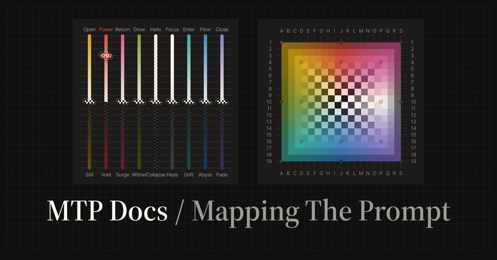
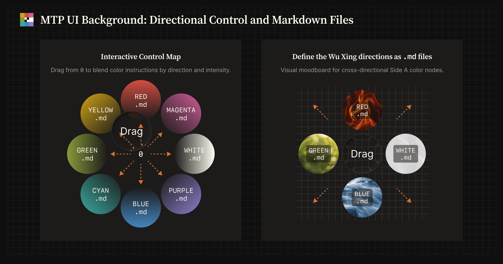
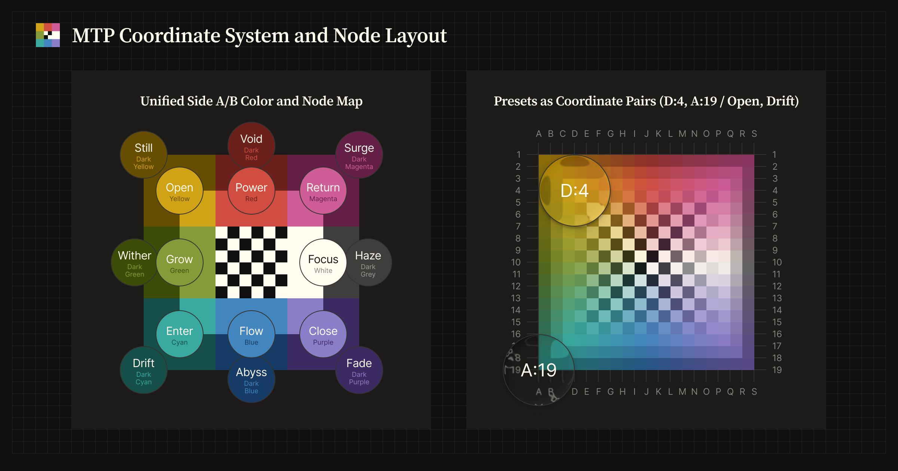
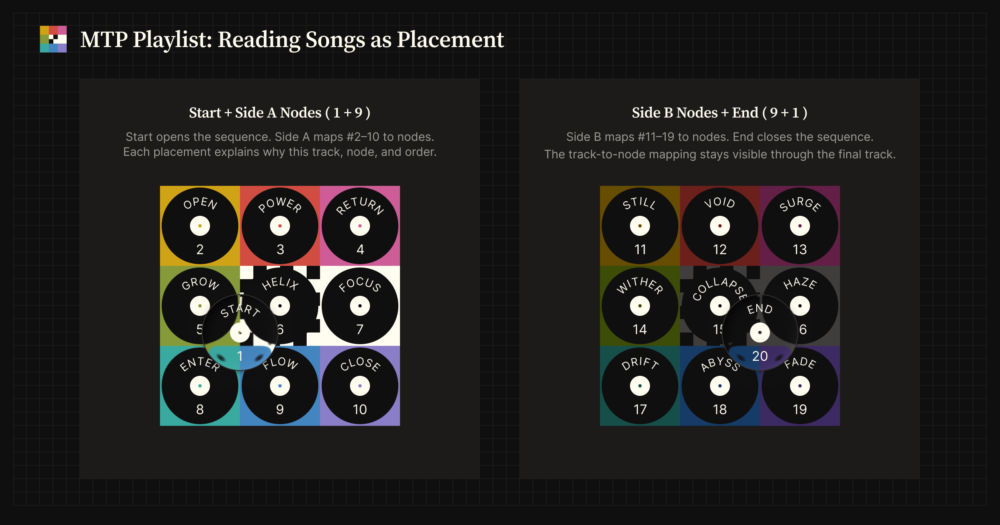

# MTP (Mapping the Prompt)

MTP is a framework for steering LLM output with grids, sliders, and presets instead of long natural-language behavior instructions.
It is designed to make the ideas and concepts in a prompt easier to express intuitively, helping the user and the LLM align with fewer instructions.

This repository publishes two Agent Skills:

- **MTP Skill**: steer LLM output with `/mtp` sliders, grid coordinates, and presets.
- **MTP Playlist Skill**: build a node-mapped music sequence with `/mtp-playlist` from a theme, genre, artist, album, era, scene, or sound world.

## What is MTP?

Traditionally, changing an AI's tone or behavior often relies on natural-language instructions such as "Act as an expert," "Be more concise," or "Think step by step." These instructions can be ambiguous and may add prompt-side noise that is unrelated to the core task.

MTP moves that behavioral steering into non-verbal parameters such as color, position, and intensity. The MTP Skill makes this framework available through the `/mtp` command, compiling those settings into structured constraints that act as a reasoning-steering filter.

- **Adjust like an EQ** — e.g. `power:100`, `flow:70`, or a grid coordinate such as `J:10`
- **Blend like a Mixer** — named presets (`synthesizer`, `strategist`, …) or explicit multi-grid tokens (e.g. `D:16 A:1`)
- **Change the vibe, not the task** — shift depth, structure, and tone while keeping the base prompt intent intact

```text
/mtp power:100 Summarize this article
/mtp flow:70 Explain this concept
/mtp strategist Compare these options
```

MTP does not change the task itself. It adjusts qualities such as force, flow, depth, structure, openness, and focus.

### How MTP arguments map visually

MTP currently works through the `/mtp` command, but its arguments can be understood visually.

The slider form, `/mtp <node:intensity>`, sets the intensity of a named node such as `power:70` or `flow:100`. The grid form, `/mtp <column:row>`, selects a point on the 19×19 MTP coordinate plane, such as `J:4` or `D:16`.

Both forms describe the same underlying node system: sliders express movement by named direction and intensity, while grid coordinates express position.

#### Color-node files and directional control



*Each direction is defined by a Markdown node file. The center uses `TRANSPARENT.md` as the origin and mediating node.*

| Position | Left        | Center           | Right        |
| -------- | ----------- | ---------------- | ------------ |
| Top      | `YELLOW.md` | `RED.md`         | `MAGENTA.md` |
| Middle   | `GREEN.md`  | `TRANSPARENT.md` | `WHITE.md`   |
| Bottom   | `CYAN.md`   | `BLUE.md`        | `PURPLE.md`  |

#### Node layout and coordinate-plane UI



*Left: the 3×3 MTP node layout, including the paired Side A and Side B directions for each axis. Right: a UI concept for representing the same node space through color and 19×19 grid coordinates, allowing output tendencies to be selected by position rather than by node name.*

---

## Agent Skills quick start

### Install

Download the skill ZIP you want to add:

- [`mtp-skill.zip`](public/downloads/mtp-skill.zip)
- [`mtp-playlist-skill.zip`](public/downloads/mtp-playlist-skill.zip)

Or install from the command line (GitHub CLI is usually faster for this repository):

```bash
# GitHub CLI
gh skill install imkohenauser/mtp skills/mtp
gh skill install imkohenauser/mtp skills/mtp-playlist

# Vercel Skills CLI
npx skills add imkohenauser/mtp --skill mtp
npx skills add imkohenauser/mtp --skill mtp-playlist
```

Any **Agent Skills**–compatible host can load the skills; import steps differ by vendor, so follow your client's current documentation.

For shared installation steps, see [Skills Installation](https://mappingtheprompt.com/skills/).

### MTP Skill

Control the model with sliders, grid coordinates, or presets.

```text
/mtp power:100                  → Moderate force; clearer, more assertive output
/mtp flow:70                    → Full flow; smooth, connected prose
/mtp J:4                        → Equivalent steering to /mtp power:100 (grid coordinate)
/mtp D:16 A:1                   → Multi-grid coordinates
/mtp strategist                 → Preset blend
```

**Requirement:** Python 3 (standard library only, no extra packages).

For platform notes, `/mtp` syntax reference, and references, see [skills/mtp/README.md](./skills/mtp/README.md).

### MTP Playlist Skill

Build a deliberately sequenced music arc from a theme, genre, artist, album, era, scene, or sound world.

```text
/mtp-playlist Madonna from present to past
/mtp-playlist Moonlit 80s Heavy Metal
/mtp-playlist Mobb Deep "Shook Ones Pt. II" at Start, 90s New York Rap
```

For usage details and playlist format notes, see [MTP Playlist Skill](https://mappingtheprompt.com/skills/mtp-playlist/) and [skills/mtp-playlist/README.md](./skills/mtp-playlist/README.md).


*MTP Playlist reads the `1+9+9+1` arc as Start + Side A (left), then Side B + End (right).*

---

## Documentation

Product documentation, reference, and optional reading are on the documentation site below.

**Mapping the Prompt documentation site (MTP Docs):**  
[mappingtheprompt.com](https://mappingtheprompt.com/)

### Articles

Medium articles by the author, covering the framework and the engineering behind this repository.

- [Mapping the Prompt: Steering LLM Output with a 3x3 Color Grid](https://medium.com/@imkohenauser/mapping-the-prompt-steering-llm-output-with-a-3x3-color-grid-a565452b7022) — an introduction to the MTP framework
- [Packaging an Open Source Agent Skill: CLI Install, ZIP Releases, and Astro/Starlight Docs](https://medium.com/@imkohenauser/packaging-an-open-source-agent-skill-cli-install-zip-releases-and-astro-starlight-docs-8a57e75d8a0c) — how this repository is structured, released, and documented

### For AI agents

During the documentation site build, key pages are aggregated into a single `llms.txt` file. You can provide this file to AI agents to supply them with the context needed to understand and explain the site.

[mappingtheprompt.com/llms.txt](https://mappingtheprompt.com/llms.txt)

---

## Roadmap

- [x] MTP Framework concept [alpha] — 2025-09-01
- [x] MTP Skill [beta] — 2026-03-15
- [x] MTP Docs (Mapping the Prompt documentation site) — 2026-05-05
- [x] MTP Playlist Skill — 2026-06-23
- [ ] MTP Interactive UI [planned]

---

## License

MIT — [LICENSE](./LICENSE).
